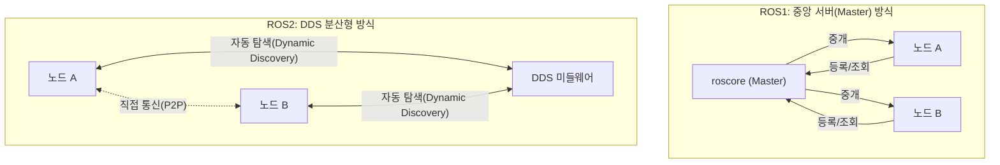

# 01장. ROS와 ROS2 — 공부하기

> 🏠 [메인 저장소로 돌아가기](https://github.com/2101080JUNGJINYOUNG/ROS2-Robotics-Practice)  ·  📝 [실습 문제 풀어보기](./문제.md)

이 챕터의 과제는 "ROS가 뭔지"를 개념적으로 정리하는 것입니다. 코드나 명령어 실습이 아니라 용어 정의 과제이므로, 아래 개념들의 차이를 정확히 구분하면 과제를 충분히 풀 수 있습니다.

## 목차

- [1. 이 용어들이 왜 헷갈리는가](#1-이-용어들이-왜-헷갈리는가)
- [2. 소프트웨어 플랫폼](#2-소프트웨어-플랫폼)
- [3. 미들웨어](#3-미들웨어)
- [4. 프레임워크](#4-프레임워크)
- [5. 메타 운영체제](#5-메타-운영체제)
- [6. DDS](#6-dds)
- [7. 응용 사례 조사 팁](#7-응용-사례-조사-팁)
- [8. 스스로 확인하는 질문](#8-스스로-확인하는-질문)

## 1. 이 용어들이 왜 헷갈리는가

"플랫폼", "미들웨어", "프레임워크", "운영체제"는 전부 "프로그램이 돌아가는 바탕"이라는 느낌이 있어서 구분 없이 쓰이곤 합니다.

하지만 "누가 무엇을 담당하는가"의 관점에서 보면 명확히 구분됩니다. 아래 항목을 하나씩 짚어보겠습니다.

## 2. 소프트웨어 플랫폼

- **정의**: 어떤 프로그램이 실행되기 위해 필요한 하드웨어 + 운영체제의 조합
- **예시**: "윈도우 11 + x86 CPU", "우분투 20.04 + ARM CPU(Jetson Nano)"
- **핵심**: 같은 프로그램이라도 플랫폼이 다르면 다시 빌드하거나 포팅해야 할 수 있습니다. "실행 환경의 조합"이라는 점만 기억하면 됩니다.

## 3. 미들웨어

미들웨어는 서로 다른 운영체제·언어로 만들어진 애플리케이션들이 데이터를 주고받을 수 있도록 중간에서 통역해주는 소프트웨어입니다. 이름 그대로 "중간(middle)"에 있는 "소프트웨어(ware)"입니다.

- C++로 짠 프로그램과 Python으로 짠 프로그램은 언어·메모리 구조가 달라 직접 연결할 수 없습니다.
- 미들웨어가 이 둘 사이에서 데이터를 규격화해서 전달해줍니다.
- ROS2에서는 이 역할을 **DDS**가 담당합니다.

## 4. 프레임워크

프레임워크는 개발자가 매번 처음부터 구조를 짜지 않아도 되도록, 미리 정해진 뼈대를 제공하는 개발 환경입니다.

- 가장 중요한 특징은 제어의 흐름(Control Flow)을 프레임워크가 가져간다는 것입니다. 이를 **IoC(Inversion of Control, 제어의 역전)** 라고 부릅니다.
- 일반 라이브러리는 내가 함수를 호출해서 쓰지만, 프레임워크는 정해준 자리(콜백 함수 등)에 내 코드를 끼워 넣으면 프레임워크가 알아서 호출해줍니다.
- ROS2의 노드 콜백 구조(퍼블리셔/서브스크라이버 콜백, 타이머 콜백)가 바로 이 IoC 구조입니다 — 언제 콜백이 호출될지는 내가 아니라 rclcpp가 결정합니다.

## 5. 메타 운영체제

메타 운영체제는 여러 대의 컴퓨터/장치에 분산되어 있는 시스템을 마치 하나의 컴퓨터인 것처럼 통합해서 관리해주는 지휘 소프트웨어를 말합니다.

- 일반 운영체제(윈도우, 리눅스)는 한 대의 컴퓨터 안에서 CPU, 메모리, 파일시스템을 관리합니다.
- 로봇은 카메라, 모터 컨트롤러, 메인 컴퓨터 등 여러 장치가 네트워크로 연결되어 하나의 시스템처럼 동작해야 합니다.
- ROS가 정확히 이 역할을 합니다 — 물리적으로 분산된 여러 노드(프로세스)들이 한 프로그램의 여러 부분처럼 통신·협력하게 만들어줍니다.

그래서 ROS를 "메타 운영체제"라고 부릅니다. 실제 리눅스 커널 같은 운영체제는 아니지만, 운영체제가 하는 역할을 로봇 시스템 레벨에서 수행한다는 뜻입니다.

## 6. DDS

DDS(Data Distribution Service)는 ROS2에서 노드 간 통신을 담당하는 미들웨어입니다.

- ROS1은 `roscore`라는 중앙 서버(Master)가 모든 노드의 정보를 관리하고 중개했습니다.
- ROS2는 DDS를 채택하면서 중앙 서버 없이 노드들이 네트워크상에서 서로를 자동으로 찾아내는 방식(**Dynamic Discovery**, 동적 검색)으로 바뀌었습니다.
- 이 구조 덕분에 특정 노드(Master)가 죽어도 나머지 노드들끼리는 계속 통신할 수 있어, 로봇처럼 안정성이 중요한 시스템에 더 적합합니다.

> [!IMPORTANT]
> ROS1은 Master가 죽으면 새 노드가 기존 노드를 찾지 못하는 단일 장애점(Single Point of Failure) 구조입니다. ROS2는 DDS의 동적 검색 덕분에 특정 노드가 죽어도 나머지 노드끼리는 계속 통신할 수 있습니다.

DDS의 이런 특징은 [03\~05장 공부하기](../03_04_05_ROS2특징과DDS/README.md)에서 더 자세히 다룹니다.

## 7. 응용 사례 조사 팁

> [!TIP]
> 과제에서 응용 사례를 조사하라고 하면, 로봇 이름만 나열하기보다 "이 로봇이 ROS/ROS2의 어떤 특징(분산 통신, 노드 재사용성, 다양한 언어 지원 등) 덕분에 가능했는지"를 연결해서 설명하면 좋습니다.

예를 들어 Boston Dynamics Spot, LG전자 클로이 서빙로봇, Autoware(자율주행 오픈소스) 같은 사례는 모두 카메라·라이다·모터 등 여러 이기종 장치를 하나의 시스템으로 통합해야 하는데, ROS의 노드 기반 구조가 "각 장치를 독립된 노드로 만들고 토픽으로 연결"하는 방식으로 이를 해결합니다.

## 8. 스스로 확인하는 질문

- 플랫폼, 미들웨어, 프레임워크의 차이를 각각 한 문장으로 설명할 수 있는가?
- "메타 운영체제"라는 표현이 왜 ROS에 붙는지 설명할 수 있는가?
- ROS1과 ROS2의 통신 구조가 근본적으로 어떻게 다른지(Master 유무) 설명할 수 있는가?

이 세 질문에 답할 수 있으면 01장 과제를 풀기에 충분한 배경지식을 갖춘 것입니다.

---

🏠 [메인 저장소로 돌아가기](https://github.com/2101080JUNGJINYOUNG/ROS2-Robotics-Practice)
