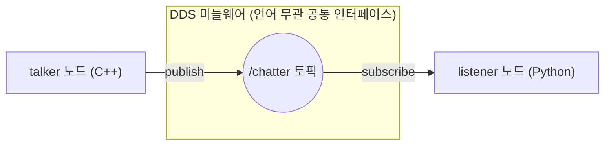

# 02장. ROS2 개발환경 구축 — 공부하기

> ⬆ [ROS2-Robotics-Practice로 돌아가기](https://github.com/2101080JUNGJINYOUNG/ROS2-Robotics-Practice/blob/main/README.md)  ·  📝 [실습 문제 풀어보기](./문제.md)

이 챕터는 ROS2(Foxy)를 실제로 설치하고 처음 동작을 확인하는 실습입니다. 명령어를 따라 치는 것도 중요하지만, 왜 이 명령어가 필요한지 알아야 나중에 문제가 생겼을 때 스스로 해결할 수 있습니다.

## 목차

- [1. source가 왜 필요한가](#1-source가-왜-필요한가)
- [2. ros2 --help, colcon --help](#2-ros2---help-colcon---help)
- [3. talker / listener로 확인하는 것](#3-talker--listener로-확인하는-것)
- [4. 워크스페이스란](#4-워크스페이스란)
- [5. 환경변수 세 가지](#5-환경변수-세-가지)
- [6. 스스로 확인하는 질문](#6-스스로-확인하는-질문)

## 1. source가 왜 필요한가

ROS2는 설치되어 있다고 해서 바로 `ros2`, `colcon` 같은 명령을 쓸 수 있는 게 아닙니다.

- 리눅스 셸은 `PATH`, `PYTHONPATH`, `LD_LIBRARY_PATH` 같은 환경변수를 보고 실행 파일과 라이브러리를 찾습니다.
- ROS2 관련 경로는 기본 환경변수에 들어있지 않으므로, `source /opt/ros/foxy/setup.bash`로 이 환경변수들을 현재 터미널 세션에 추가해줘야 합니다.

> [!IMPORTANT]
> **왜 `source`로 실행해야 하는가**: 스크립트를 `./setup.bash`처럼 실행하면 별도의 자식 프로세스에서 실행되어 환경변수가 부모 셸(내가 쓰는 터미널)에 반영되지 않습니다. `source`(또는 `.`)로 실행하면 현재 셸 안에서 바로 실행되어 변경이 그대로 남습니다.

> [!WARNING]
> 새 터미널을 열 때마다 이 명령을 실행해야 하고(또는 `~/.bashrc`에 등록해서 자동화), 실행하지 않으면 `ros2: command not found` 에러가 납니다.

## 2. `ros2 --help`, `colcon --help`

- `ros2` — ROS2의 모든 커맨드라인 기능(topic, node, run, pkg, interface 등)을 담고 있는 최상위 명령어
- `colcon` — ROS2 워크스페이스를 빌드하는 빌드 툴 (자세한 설명은 [13장 공부하기](../13_ROS2파일시스템/README.md) 참고)

`--help`는 각 명령어가 어떤 하위 명령어(subcommand)를 갖고 있는지 확인하는 용도입니다. 새 도구를 처음 쓸 때 항상 먼저 확인해보는 습관을 들이면 좋습니다.

## 3. talker / listener로 확인하는 것

```bash
# demo_nodes_cpp 패키지 안의 talker 실행 파일 실행 (C++로 작성된 퍼블리셔 노드, 터미널 1)
ros2 run demo_nodes_cpp talker
# demo_nodes_py 패키지 안의 listener 실행 파일 실행 (Python으로 작성된 서브스크라이버 노드, 터미널 2)
ros2 run demo_nodes_py listener
```

두 명령은 서로 다른 터미널에서 각각 실행합니다.

- `talker`는 일정 주기로 메시지를 토픽에 발행(publish)하는 노드
- `listener`는 그 토픽을 구독(subscribe)해서 받은 메시지를 화면에 출력하는 노드

여기서 중요한 점: `talker`는 C++로, `listener`는 Python으로 만들어졌습니다. 서로 다른 언어로 만든 두 노드가 문제없이 통신한다는 것 자체가 "ROS2는 언어에 상관없이 토픽이라는 공통 인터페이스로 통신한다"는 것을 보여주는 가장 기본적인 검증입니다.



## 4. 워크스페이스란

워크스페이스는 "내가 작업할 ROS2 패키지들을 모아두는 폴더 구조"입니다. 관례적으로 `~/ros2_ws/src` 아래에 패키지들을 만들고, `~/ros2_ws`에서 빌드합니다.

```bash
# ~/ros2_ws/src 경로를 상위 폴더까지 한 번에 생성 (-p: 이미 있어도 에러 없이 통과, 없는 중간 경로도 함께 생성)
mkdir -p ~/ros2_ws/src
# 워크스페이스 최상위 폴더로 이동 (colcon build는 워크스페이스 루트에서 실행해야 함)
cd ~/ros2_ws
# src/ 안의 모든 패키지를 빌드. --symlink-install은 파일을 복사하지 않고 심볼릭 링크로 연결
colcon build --symlink-install
```

빌드가 끝나면 워크스페이스 안에 다음 4개 폴더가 생깁니다.

- `src/` — 내가 작성한 패키지의 원본 소스 코드 (직접 관리하는 유일한 폴더)
- `build/` — 빌드 중간 산출물(오브젝트 파일 등)
- `install/` — 실제 실행 가능한 결과물(실행 파일, 라이브러리, 설정 파일)
- `log/` — 빌드 로그 기록

`--symlink-install` 옵션을 주면 파이썬 스크립트 등을 `install/`에 복사하는 대신 심볼릭 링크로 연결해서, `src/` 수정 시 재빌드 없이 바로 반영됩니다(개발 중 편리).

## 5. 환경변수 세 가지

이 세 환경변수는 보통 `~/.bashrc` 맨 아래에 추가해서, 터미널을 열 때마다 자동 적용되게 합니다.

- **`ROS_DOMAIN_ID`**: 같은 네트워크 안에서 어떤 노드들끼리 서로를 발견할지 구분하는 값(0\~232). 옆 사람의 ROS2 노드와 내 노드가 같은 네트워크(같은 와이파이 등)에 있다면, 서로 다른 값을 써서 통신이 섞이지 않게 분리할 수 있습니다.

> [!TIP]
> 실습실처럼 여러 사람이 같은 와이파이에서 동시에 turtlesim이나 talker/listener를 실행하면 서로의 토픽이 섞여 보일 수 있습니다. 이런 경우 각자 다른 `ROS_DOMAIN_ID` 값을 설정하면 통신이 분리됩니다.
- **`ROS_NAMESPACE`**: 노드/토픽 이름 앞에 붙는 접두사. 예를 들어 `jetson0`으로 설정하면 노드들이 `/jetson0/노드이름`처럼 묶여, 로봇이 여러 대일 때 토픽을 구분할 수 있습니다.
- **`RMW_IMPLEMENTATION`**: ROS2가 실제로 사용할 DDS 구현체(벤더)를 지정. ROS2는 DDS라는 표준(스펙)만 정의하고, 실제 구현은 Fast DDS, Cyclone DDS 등 여러 프로젝트가 제공하므로 이 변수로 선택합니다(기본값은 보통 Fast DDS).

## 6. 스스로 확인하는 질문

- `source` 없이 `ros2` 명령을 치면 왜 안 되는지 설명할 수 있는가?
- `build/install/log/src` 각각이 어떤 역할인지 구분할 수 있는가?
- `ROS_DOMAIN_ID`가 왜 필요한지, 어떤 상황에서 문제를 해결해주는지 설명할 수 있는가?

이 정도를 스스로 설명할 수 있으면 2장 실습을 그대로 재현하고 이해할 수 있습니다.

---

⬆ [ROS2-Robotics-Practice로 돌아가기](https://github.com/2101080JUNGJINYOUNG/ROS2-Robotics-Practice/blob/main/README.md)  ·  📝 [실습 문제 풀어보기](./문제.md)  ·  ➡ [다음 장: 03\~05장. ROS2의 특징, DDS, 패키지와 노드](../03_04_05_ROS2특징과DDS/README.md)
