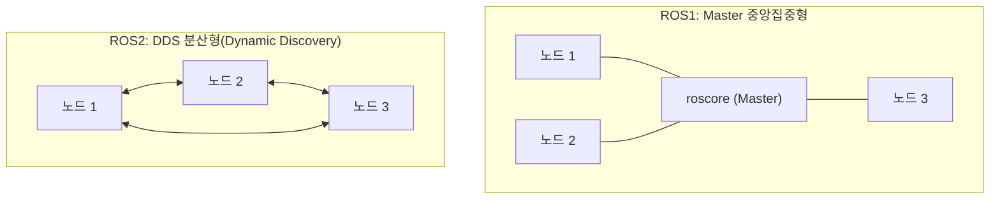
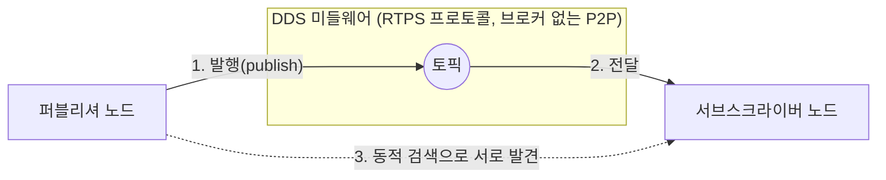
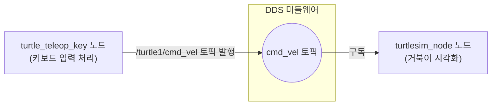

# 03\~05장. ROS2의 특징, DDS, 패키지와 노드 — 공부하기

> ⬆ [ROS2-Robotics-Practice로 돌아가기](https://github.com/2101080JUNGJINYOUNG/ROS2-Robotics-Practice)  ·  📝 [실습 문제 풀어보기](./문제.md)

세 챕터를 묶은 과제라서 배경지식도 세 갈래로 나눠서 정리합니다. 이 문서 하나로 3장(ROS2 특징), 4장(DDS), 5장(turtlesim 실습)을 모두 준비할 수 있습니다.

## 목차

- [3장. ROS1과 ROS2, 무엇이 다른가](#3장-ros1과-ros2-무엇이-다른가)
- [3-1. 멀티프로세싱, 분산 컴퓨팅, 네트워크 통신 기술](#3-1-멀티프로세싱-분산-컴퓨팅-네트워크-통신-기술)
- [4장. DDS 동작 원리](#4장-dds-동작-원리)
- [5장. turtlesim으로 패키지/노드 실습](#5장-turtlesim으로-패키지노드-실습)
- [스스로 확인하는 질문](#스스로-확인하는-질문)

## 3장. ROS1과 ROS2, 무엇이 다른가

**통신 구조**

- ROS1(TCPROS + Master): `roscore`라는 중앙 서버(Master)가 반드시 떠 있어야 합니다. 모든 노드는 Master에 등록하고, Master가 통신할 노드들을 짝지어줍니다. 문제는 Master가 죽으면 새 노드가 기존 노드를 찾을 수 없다는 것(단일 장애점, Single Point of Failure)입니다.
- ROS2(DDS + 분산형): Master가 없습니다. DDS가 네트워크에 멀티캐스트로 "나 여기 있다"는 신호를 주기적으로 보내고, 다른 노드들이 자동으로 서로를 찾습니다(Dynamic Discovery). 노드 하나가 죽어도 나머지 통신에는 영향이 없습니다.

**TCPROS(ROS1의 통신 프로토콜)**

- ROS1이 실제로 데이터를 주고받을 때 쓰는 프로토콜의 이름이 **TCPROS**입니다. "연결"을 중심으로 동작하는 ROS 전용 프로토콜로, 중앙의 ROS Master를 통해 노드 간 1:1 TCP 소켓 연결을 맺은 뒤 그 연결을 통해서만 데이터를 주고받습니다. TCP 자체의 신뢰성에만 의존하기 때문에 세밀한 통신 품질 조절(QoS)은 불가능합니다.
- 반면 ROS2의 DDS는 "데이터"를 중심으로 동작하는 산업 표준 기술로, Master 없는 분산형 구조에서 노드들이 UDP 기반으로 데이터를 발행·구독하며 QoS로 신뢰성/속도를 상황에 맞게 조절할 수 있습니다.
- 정리하면 TCPROS는 "1:1 연결 기반, Master 필요, QoS 없음", DDS는 "데이터 중심, Master 불필요, 세밀한 QoS 지원"으로 대비됩니다.

## 3-1. 멀티프로세싱, 분산 컴퓨팅, 네트워크 통신 기술

DDS와 ROS2의 분산 구조를 제대로 이해하려면 "여러 작업을 동시에 처리한다"는 개념이 컴퓨터 안(멀티프로세싱)과 컴퓨터 사이(분산 컴퓨팅)에서 서로 다르게 구현된다는 것을 구분해야 합니다.

- **멀티프로세싱(Multiprocessing)**: 하나의 컴퓨터(CPU 칩) 안에 있는 여러 개의 독립적인 처리 장치, 즉 코어들이 각자 다른 작업(프로세스)을 맡아 동시에 처리하는 방식입니다. 메모리(RAM)를 여러 코어가 공유합니다.
- **분산 컴퓨팅(Distributed Computing)**: 네트워크로 연결된 여러 대의 독립된 컴퓨터가 마치 하나의 시스템처럼 협력해서 공동의 목표를 수행하는 방식입니다. 각 컴퓨터는 자신만의 메모리를 따로 가지며, 메모리를 공유하는 대신 네트워크 통신으로 데이터를 주고받습니다.
- ROS2가 여러 대의 컴퓨터(Jetson Nano, 노트북 등)에 나뉜 노드들을 하나의 시스템처럼 통신시키는 것이 바로 이 분산 컴퓨팅의 예입니다 — DDS가 그 "네트워크 통신" 부분을 담당합니다.

> [!NOTE]
> 멀티프로세싱은 "메모리 공유", 분산 컴퓨팅은 "메모리 분리 + 네트워크 통신"이 핵심 차이입니다. ROS2 노드들이 서로 다른 컴퓨터에서 실행될 수 있는 것도 분산 컴퓨팅 구조이기 때문입니다.

분산 컴퓨팅이 실제로 동작하려면 컴퓨터들을 물리적으로 연결하는 **네트워크 통신 기술**이 필요합니다.

- **LAN(Local Area Network, 근거리 통신망)**: 가정이나 사무실처럼 좁은 공간을 연결하는 네트워크로, 유선인 **이더넷(Ethernet)**과 무선인 **와이파이(Wi-Fi)**가 대표적입니다.
- **WAN(Wide Area Network, 광역 통신망)**: 도시와 국가를 넘어 넓은 지역을 연결하는 네트워크로, 광케이블이나 5G 같은 이동통신 기술이 여기에 해당합니다. 인터넷은 전 세계의 WAN들이 연결된 것입니다.
- **PAN(Personal Area Network, 개인 통신망)**: 개인이 사용하는 장치 간의 초근거리 통신망으로, **블루투스(Bluetooth)**가 대표적입니다.
- 물리적인 연결 방식(유선/무선, 근거리/광역)은 서로 다르지만, 이 모든 기술은 **TCP/IP**라는 공통 통신 규약(프로토콜)을 따르기 때문에 인터넷이라는 하나의 네트워크로 함께 동작할 수 있습니다. TCP/IP의 4계층 구조는 [26장 공부하기](../26_네트워크와개발환경구축/README.md)에서 더 자세히 다룹니다.



> [!WARNING]
> ROS1은 Master(`roscore`)가 죽으면 새 노드가 기존 노드를 찾을 수 없는 단일 장애점(Single Point of Failure) 구조입니다. 로봇처럼 안정성이 중요한 시스템에서는 이 점이 큰 약점이 됩니다.

**실시간 시스템(Real-Time System)**

- **Hard Real-Time**: 마감을 못 지키면 시스템 실패로 간주 (예: 자동차 에어백)
- **Soft Real-Time**: 가끔 늦어도 성능 저하 정도로 넘어감 (예: 동영상 스트리밍)
- DDS는 QoS 설정으로 이런 실시간성 요구사항을 어느 정도 조절할 수 있게 설계되었습니다.

**라이선스(GPL vs Apache 2.0)**

- GPL: 이 코드를 가져다 쓴 파생 소프트웨어도 반드시 소스코드를 공개해야 하는 강한 카피레프트 라이선스
- Apache 2.0: 소스코드 공개 의무 없이 상업적으로도 자유롭게 사용·수정 가능
- ROS2가 기업 참여가 더 쉬운 Apache 2.0 계열을 채택한 것도 확산에 영향을 준 요인 중 하나입니다.

## 4장. DDS 동작 원리

**미들웨어(Middleware)란?**

미들웨어는 운영체제(OS)와 응용 프로그램 사이에 위치해서, 서로 다른 시스템·언어로 만들어진 프로그램들이 원활하게 통신하고 데이터를 교환하도록 다리 역할을 해주는 중개 소프트웨어입니다. 개발자는 통신 방식의 세부 구현을 직접 처리할 필요 없이, 미들웨어가 제공하는 표준화된 방식으로 데이터를 주고받기만 하면 됩니다. ROS2에서는 **DDS**가 바로 이 미들웨어 역할을 담당합니다(1장에서 다룬 "미들웨어" 개념이 DDS로 구체화된 것입니다).

DDS는 RTPS(Real-Time Publish-Subscribe) 프로토콜 기반으로 동작하는 미들웨어 표준입니다.

- **동적 검색(Dynamic Discovery)**: 별도의 브로커(중개 서버) 없이, 새 노드가 나타나면 자동으로 기존 노드들과 서로의 존재를 알게 됩니다.
- **브로커 방식과의 차이**: MQTT 같은 다른 pub/sub 프로토콜은 브로커가 모든 메시지를 중계하는 중앙집중형 구조인데, DDS는 브로커 없이 노드끼리 직접 통신(P2P)합니다. 지연(latency)이 더 적고, 브로커가 다운돼도 나머지 통신에 영향이 없어 실시간성이 중요한 로봇 제어에 채택되었습니다.

**RTPS(Real-Time Publish-Subscribe) 프로토콜**

RTPS는 DDS가 실제로 데이터를 전송할 때 쓰는 핵심 통신 프로토콜입니다.

- 중앙 서버(브로커) 없이, 네트워크에 참여한 노드들이 서로를 자동으로 발견하고 직접 통신하는 분산형 구조를 가집니다(위의 동적 검색이 바로 RTPS 계층에서 이루어집니다).
- 기본적으로 **UDP** 기반 전송을 사용해 빠른 속도를 확보하면서도, UDP 자체는 전달을 보장하지 않기 때문에 RTPS 프로토콜 안에 **데이터 재전송(retransmission)** 같은 신뢰성 보장 기능을 내장해서, 속도와 안정성을 상황에 맞게 모두 확보할 수 있게 설계되어 있습니다.
- 즉 "UDP처럼 빠르지만, TCP처럼 필요할 때는 재전송으로 신뢰성도 챙기는" 프로토콜이라고 이해하면 됩니다 — 이 신뢰성 조절 기능이 바로 아래에서 설명하는 QoS의 `reliable`/`best_effort` 설정으로 노출됩니다.



- **QoS(Quality of Service)**: 통신의 신뢰성, 지연, 버퍼 크기 등을 세밀하게 조절하는 설정.
- `best_effort` — 전달 보장 안 함, 대신 빠름 (예: 카메라 영상처럼 가끔 유실돼도 최신 데이터가 중요한 경우)
- `reliable` — 전달 보장 (예: 센서 값처럼 무조건 다 받아야 하는 경우)
- 이 개념은 18\~20장 코드의 `rclcpp::QoS(rclcpp::KeepLast(10))`에서 실제로 등장합니다.

> [!NOTE]
> QoS는 퍼블리셔와 서브스크라이버 양쪽에 설정하는데, 서로 호환되지 않는 QoS(예: 한쪽은 `reliable`, 한쪽은 `best_effort`)를 쓰면 연결이 아예 되지 않을 수 있습니다. 통신이 안 될 때 QoS 불일치도 의심해볼 만한 원인입니다.

## 5장. turtlesim으로 패키지/노드 실습

turtlesim은 ROS2에 기본 포함된 거북이 시뮬레이터로, 토픽/노드 개념을 눈으로 직접 보기 위한 교육용 도구입니다.

```bash
ros2 pkg list # 설치된 전체 패키지 목록 출력
ros2 pkg executables turtlesim # turtlesim 패키지 안의 실행 파일 목록 출력
ros2 run turtlesim turtlesim_node # 거북이 시뮬레이터 창 실행 (turtlesim 패키지의 turtlesim_node 실행 파일 구동)
ros2 run turtlesim turtle_teleop_key # 키보드로 거북이를 조종하는 노드 실행 (별도 터미널에서 실행)
```

`turtlesim_node`와 `turtle_teleop_key`는 서로 다른 두 개의 노드입니다. `turtle_teleop_key`가 방향키 입력을 받아 속도 값을 토픽으로 발행하면, `turtlesim_node`가 이를 구독해 화면 속 거북이를 움직입니다. "입력을 처리하는 노드"와 "실제 동작(시각화)을 하는 노드"가 분리되어 있다는 것이 핵심이며, 이 구조는 24장(다이내믹셀), 25장(라인검출)에서도 반복됩니다.



```bash
ros2 topic list # 현재 실행 중인 토픽 이름 목록 출력
ros2 service list # 현재 실행 중인 서비스 목록 출력
ros2 action list # 현재 실행 중인 액션 목록 출력
ros2 node list # 현재 실행 중인 노드 목록 출력
ros2 node info /turtlesim # 특정 노드(/turtlesim)가 가진 토픽/서비스/액션 상세 정보 조회
```

`rqt_graph`는 현재 실행 중인 노드와 토픽의 연결 관계를 그래프로 보여주는 시각화 도구입니다. 실행하면 `/teleop_turtle` → `/turtlesim` 화살표가 나오는데, 이 화살표가 토픽을 통한 pub/sub 연결입니다.

거북이로 8자를 그리는 실습은 `turtle_teleop_key`가 방향키뿐 아니라 G·B·V·C·D·E·R·T 같은 문자 키도 인식해서 속도/회전 값을 다르게 발행하도록 만들어져 있기 때문에 가능합니다. `ros2 topic echo /turtle1/cmd_vel`로 실제 발행 값을 같이 관찰하면 이해가 빠릅니다.

> [!TIP]
> `rqt_graph`를 함께 실행해두면 `/teleop_turtle` → `/turtlesim`으로 이어지는 화살표를 눈으로 직접 확인할 수 있어, 토픽을 통한 pub/sub 연결을 이해하는 데 도움이 됩니다.

## 스스로 확인하는 질문

- ROS1과 ROS2 중 어느 쪽이 중앙 서버(Master) 없이 동작하는가, 그 이유는?
- DDS가 브로커 방식(MQTT)과 다른 점은 무엇인가?
- `turtlesim_node`와 `turtle_teleop_key`가 왜 별도의 노드로 분리되어 있는가?

---

⬆ [ROS2-Robotics-Practice로 돌아가기](https://github.com/2101080JUNGJINYOUNG/ROS2-Robotics-Practice)  ·  📝 [실습 문제 풀어보기](./문제.md)  ·  ➡ [다음 장: 06장. ROS2 토픽](../06_ROS2토픽/README.md)
