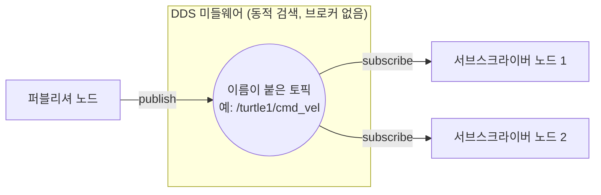

# 06장. ROS2 토픽 — 공부하기

> ⬆ [ROS2-Robotics-Practice로 돌아가기](https://github.com/2101080JUNGJINYOUNG/ROS2-Robotics-Practice)  ·  📚 [공부 목차](../README.md)  ·  📝 [실습 문제 풀어보기](./문제.md)

`geometry_msgs/Twist` 메시지와 `ros2 topic` 명령어들을 이용해 turtlesim을 직접 제어하는 실습입니다. 아래 개념만 알면 실습을 그대로 따라 하고 이해할 수 있습니다.

## 목차

- [1. 토픽이란 다시 정리](#1-토픽이란-다시-정리)
- [2. Twist 메시지 구조](#2-twist-메시지-구조)
- [3. 토픽 상태 확인 명령어](#3-토픽-상태-확인-명령어)
- [4. ros2 topic pub으로 직접 발행하기](#4-ros2-topic-pub으로-직접-발행하기)
- [5. 스스로 확인하는 질문](#5-스스로-확인하는-질문)

## 1. 토픽이란 다시 정리

토픽은 이름이 붙은 통신 채널입니다.

- 퍼블리셔(Publisher)는 특정 이름의 토픽에 메시지를 계속 발행(publish)합니다.
- 서브스크라이버(Subscriber)는 같은 이름의 토픽을 구독(subscribe)해서 메시지를 받습니다.
- 핵심 특징: 퍼블리셔와 서브스크라이버가 서로의 존재를 몰라도 됩니다(1:다 비동기 통신). 발행자는 누가 듣는지 신경 쓰지 않고 토픽에 쏘고, 구독자도 누가 보내는지 몰라도 그 토픽만 구독하면 메시지를 받습니다.



> [!NOTE]
> 퍼블리셔와 서브스크라이버는 서로의 존재를 몰라도 됩니다. 토픽 이름과 메시지 타입만 같으면 DDS가 알아서 연결해줍니다.

## 2. Twist 메시지 구조

Twist는 로봇의 속도를 표현하는 대표적인 메시지 타입입니다.

```yaml
linear:
  x: 0.0   # 전/후 이동 속도
  y: 0.0   # 좌/우 이동 속도 (일반 바퀴 로봇에서는 보통 0)
  z: 0.0   # 상/하 이동 속도 (드론이 아니면 보통 0)
angular:
  x: 0.0   # roll (좌우로 기울어지는 회전, 보통 0)
  y: 0.0   # pitch (앞뒤로 기울어지는 회전, 보통 0)
  z: 0.0   # yaw (제자리에서 좌우로 도는 회전) — 실제로 쓰이는 값
```

turtlesim이나 일반적인 2륜 바퀴 로봇에서는 `linear.x`(전진/후진 속도)와 `angular.z`(회전 속도) 두 값만 실질적으로 쓰입니다. 나머지 4개 값은 3차원 공간에서 자유롭게 움직이는 로봇(드론 등)을 위한 값입니다.

## 3. 토픽 상태 확인 명령어

```bash
ros2 topic list             # 현재 발행/구독 중인 토픽 이름 목록 출력
ros2 topic list -t          # 토픽 이름과 함께 메시지 타입까지 표시 (-t: type)
ros2 topic echo /turtle1/cmd_vel     # 해당 토픽에 발행되는 메시지 내용을 실시간으로 출력
ros2 topic bw /turtle1/cmd_vel       # 초당 대역폭(전송 데이터 크기) 확인
ros2 topic hz /turtle1/cmd_vel       # 초당 발행 빈도(주기) 확인
ros2 node list               # 현재 실행 중인 노드 목록 출력
ros2 node info /teleop_turtle        # 특정 노드(/teleop_turtle)의 퍼블리셔/구독자/서비스 정보 조회
```

`bw`(bandwidth)는 "얼마나 많은 데이터가 오가는지", `hz`(hertz)는 "얼마나 자주 메시지가 발행되는지"를 측정합니다. 둘 다 통신이 원하는 속도로 잘 이루어지고 있는지 점검할 때 씁니다.

> [!TIP]
> `hz`는 평균 rate뿐 아니라 최소/최대/표준편차까지 보여줍니다. 표준편차가 크면 발행 주기가 불규칙하다는 뜻이므로, 주기가 일정해야 하는 센서/제어 토픽에서는 표준편차도 함께 확인하는 것이 좋습니다.

## 4. `ros2 topic pub`으로 직접 발행하기

```bash
# --rate 1: 초당 1번 발행 / geometry_msgs/msg/Twist: 메시지 타입 / 뒤 문자열: YAML 형식의 필드 값
# linear.x=2.0 -> 전진 속도, angular.z=1.8 -> 제자리 회전(yaw) 속도 -> 결과적으로 원을 그리며 이동
ros2 topic pub --rate 1 /turtle1/cmd_vel geometry_msgs/msg/Twist "{linear: {x: 2.0, y: 0.0, z: 0.0}, angular: {x: 0.0, y: 0.0, z: 1.8}}"
```

- 코드를 작성하지 않고도 커맨드라인에서 직접 토픽에 메시지를 발행하는 방법입니다.
- `--rate 1`은 초당 1번 발행한다는 뜻이고, 뒤의 중괄호는 YAML 형식으로 Twist 필드 값을 채운 것입니다.
- `linear.x`가 양수(전진)이면서 `angular.z`가 0이 아니면(회전) 거북이가 원을 그리며 도는데, 이는 "전진하면서 동시에 방향을 계속 바꾸면 원 궤적이 된다"는 물리적으로 당연한 결과입니다.
- `linear.x`를 키우면 원이 커지고, `angular.z`를 키우면 회전이 빨라져 원이 작아집니다. 값을 바꿔가며 실험해보면 Twist 메시지의 의미가 훨씬 명확해집니다.

> [!TIP]
> 값을 바꿔가며 실험할 때는 `linear.x`와 `angular.z`의 비율이 원의 크기를 결정한다는 점을 기억하면 예측이 쉬워집니다. 비율이 클수록(전진 대비 회전이 느릴수록) 원이 커집니다.

## 5. 스스로 확인하는 질문

- 토픽 통신에서 퍼블리셔와 서브스크라이버가 서로를 몰라도 되는 이유는?
- `linear.x`와 `angular.z`가 실제로 거북이의 어떤 움직임에 대응하는가?
- `bw`와 `hz`는 각각 무엇을 측정하는 명령어인가?
- `ros2 topic pub` 없이 거북이를 원으로 돌게 하려면 코드에서 무엇을 발행해야 하는가? (18\~20장 rclcpp 실습과 연결해서 생각해보기)
---

⬆ [ROS2-Robotics-Practice로 돌아가기](https://github.com/2101080JUNGJINYOUNG/ROS2-Robotics-Practice)  ·  📚 [공부 목차](../README.md)  ·  📝 [실습 문제 풀어보기](./문제.md)  ·  ➡ [다음 장: 10장. ROS2 인터페이스](../10_ROS2인터페이스/README.md)
