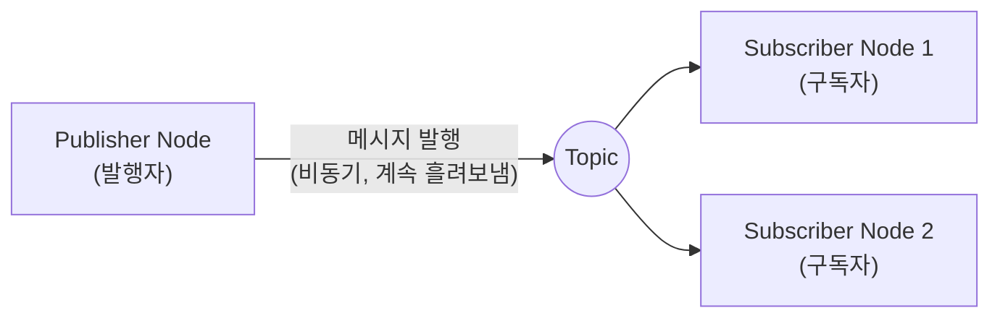
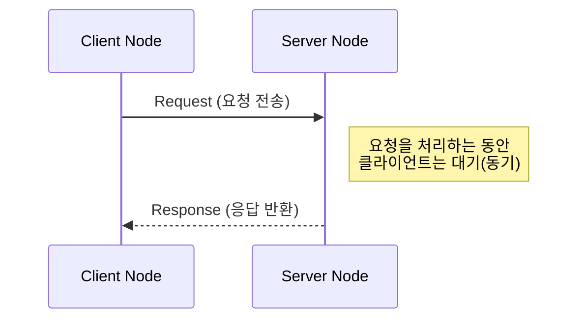
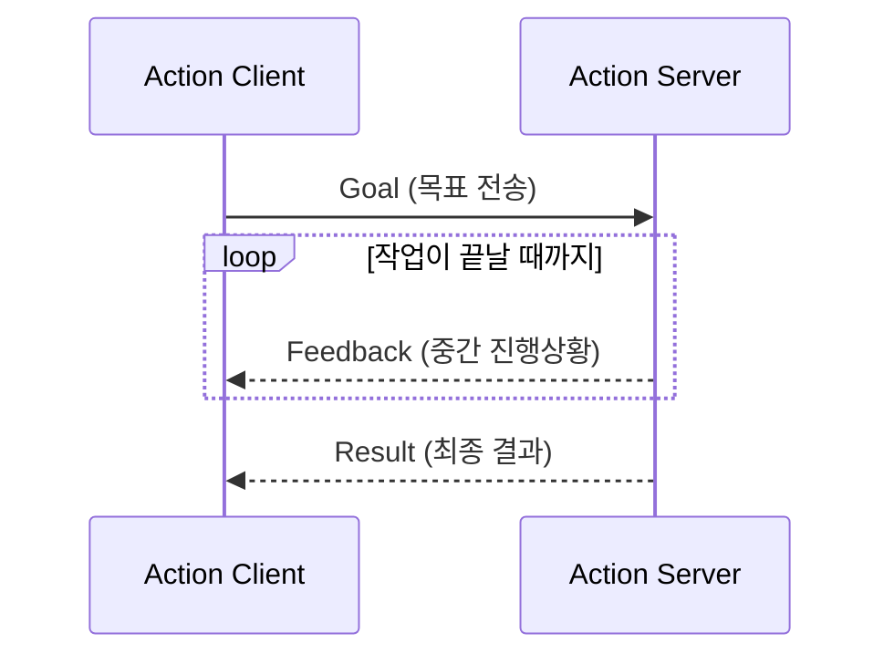

# 10장. ROS2 인터페이스 — 공부하기

> ⬆ [ROS2-Robotics-Practice로 돌아가기](https://github.com/2101080JUNGJINYOUNG/ROS2-Robotics-Practice)  ·  📚 [공부 목차](../README.md)

"메시지, 토픽, 서비스, 액션, 인터페이스"라는 다섯 용어를 구분하고, 실제 인터페이스 구조를 조회해보는 실습입니다. 이 용어들은 뒤에 나오는 모든 챕터(특히 18\~20장 rclcpp)에서 계속 등장하므로 여기서 확실히 구분해두면 이후 학습이 수월해집니다.

## 목차

- [1. 인터페이스](#1-인터페이스--데이터의-설계도)
- [2. 메시지](#2-메시지--토픽-통신의-데이터-단위)
- [3. 토픽](#3-토픽--1다-비동기-통신)
- [4. 서비스](#4-서비스--11-동기-요청응답)
- [5. 액션](#5-액션--시간이-오래-걸리는-비동기-작업)
- [6. 세 통신 방식 비교](#6-세-통신-방식-비교)
- [7. ros2 interface show로 구조 조회하기](#7-ros2-interface-show로-구조-조회하기)
- [8. 스스로 확인하는 질문](#8-스스로-확인하는-질문)

## 1. 인터페이스 — 데이터의 "설계도"

인터페이스는 노드 간에 주고받는 데이터의 구조(형식)를 정의한 것입니다. `.msg`(메시지용), `.srv`(서비스용), `.action`(액션용) 세 종류의 파일로 정의됩니다.

예를 들어 `geometry_msgs/msg/Twist`는 `.msg` 파일로 정의된 인터페이스이고, 그 안에 `linear`, `angular` 필드가 있다고 미리 약속되어 있는 것입니다.

> [!NOTE]
> 인터페이스는 어디까지나 "설계도" 역할만 합니다. 데이터가 실제로 어떻게(1:다로, 1:1로, 중간 피드백과 함께 등) 전달되는지는 통신 방식(토픽/서비스/액션)이 결정합니다.

## 2. 메시지 — 토픽 통신의 데이터 단위

메시지는 토픽을 통해 오가는 데이터 그 자체를 가리키는 말입니다. `.msg` 파일로 정의된 구조를 따르는 실제 데이터 인스턴스입니다.

## 3. 토픽 — 1:다 비동기 통신

06장에서 다룬 대로, 발행자가 계속 흘려보내고 구독자가 원할 때 받는 방식입니다. 발행자·구독자 수에 제한이 없고, 응답을 기다리지 않는 비동기 통신입니다.



## 4. 서비스 — 1:1 동기 요청/응답

- 클라이언트가 요청(Request)을 보내면 서버가 처리해서 응답(Response)을 돌려줄 때까지 기다립니다(동기, synchronous).
- 함수를 호출하고 리턴값을 받는 것과 비슷한 구조입니다.
- `.srv` 파일은 요청 필드와 응답 필드가 `---` 구분선으로 나뉘어 정의됩니다.



> [!TIP]
> "센서 값이 몇 초마다 계속 필요한 것"은 토픽, "한 번 물어보고 답만 받으면 되는 것"(지도 저장, 파라미터 조회 등)은 서비스가 적합합니다. 통신 방식을 고를 때 이 기준을 먼저 떠올리면 헷갈리지 않습니다.

## 5. 액션 — 시간이 오래 걸리는 비동기 작업

시간이 오래 걸리는 작업을 위한 통신 방식입니다. 서비스처럼 결과를 기다리는 것은 같지만, 중간 진행 상황(feedback)을 계속 받을 수 있고 중간 취소도 가능하다는 점이 다릅니다.

- **Goal(목표)**: "이 위치로 이동해줘" 같은 최종 목표
- **Feedback(중간 진행상황)**: "지금 70% 이동했어" 같은 중간 상태
- **Result(최종 결과)**: 작업이 끝났을 때 돌려주는 최종 결과값



예: "로봇을 목적지까지 이동시켜라"는 몇 초~몇 분 걸리고 중간 경과가 궁금하므로 액션이 적합하고, "현재 위치가 어디야?"는 즉시 답할 수 있으므로 서비스가 적합합니다.

## 6. 세 통신 방식 비교

| 방식 | 관계 | 동기/비동기 | 언제 쓰는가 |
|---|---|---|---|
| 토픽 | 1:다 | 비동기 | 센서 값처럼 계속 흘러나오는 데이터 |
| 서비스 | 1:1 | 동기(응답 대기) | 한 번 요청하고 바로 답 받는 작업 |
| 액션 | 1:1 | 비동기 + 중간 피드백 | 오래 걸리고 중간 진행상황이 필요한 작업 |

## 7. `ros2 interface show`로 구조 조회하기

```bash
# 현재 실행 중인 토픽 목록을, 각 토픽이 어떤 인터페이스 타입인지와 함께 출력
ros2 topic list -t
# geometry_msgs/msg/Twist 인터페이스의 실제 필드 구조를 텍스트로 출력
ros2 interface show geometry_msgs/msg/Twist
```

`ros2 interface show <타입>`을 실행하면 그 인터페이스가 어떤 필드로 구성되어 있는지 텍스트로 보여줍니다. 예를 들어 `turtlesim/msg/Pose`를 조회하면 `x`, `y`, `theta`, `linear_velocity`, `angular_velocity` 필드가 나오는데, 이걸로 "turtlesim 노드가 위치와 각도, 속도를 이런 필드로 발행하는구나"를 코드 없이도 알 수 있습니다.

> [!TIP]
> 이 명령은 새로운 메시지 타입을 다룰 때마다 "이 메시지 안에 어떤 필드가 있는지" 확인하는 가장 기본적인 방법이므로, 18\~20장·24\~25장 코드를 읽을 때도 계속 쓰게 됩니다.

## 8. 스스로 확인하는 질문

- 아래 세 상황에 토픽/서비스/액션 중 무엇을 써야 할지 답해보기: (1) 카메라 영상을 계속 화면에 뿌려야 한다 (2) 로봇에게 "지금 배터리 몇 %야?" 물어봐야 한다 (3) 로봇에게 "저기까지 이동해"라고 시키고 중간에 얼마나 갔는지도 보고 싶다.
- `.msg`, `.srv`, `.action` 파일이 각각 무엇을 정의하는가?
- `ros2 interface show`는 왜 필요한가? (코드를 직접 보지 않고도 무엇을 알 수 있는가)

---

⬆ [ROS2-Robotics-Practice로 돌아가기](https://github.com/2101080JUNGJINYOUNG/ROS2-Robotics-Practice)  ·  📝 [실습 문제 풀어보기](./문제.md)  ·  ➡ [다음 장: 11장. CMake 사용법](../11_CMake사용법/README.md)  ·  📚 [공부 목차](../README.md)
