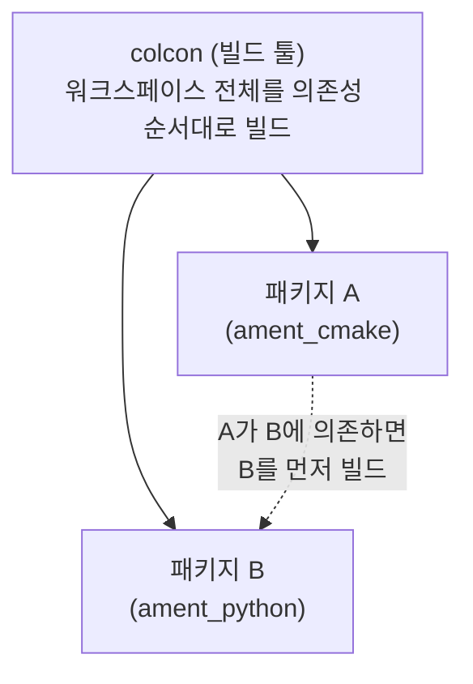
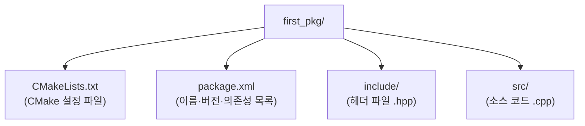

# 13장. ROS2 파일시스템 — 공부하기

> 🏠 [메인 저장소로 돌아가기](https://github.com/2101080JUNGJINYOUNG/ROS2-Robotics-Practice)  ·  📝 [실습 문제 풀어보기](./문제.md)

ROS2 패키지를 실제로 만들고 빌드하면서 파일/폴더 구조를 익히는 실습입니다. 11장(CMake)의 지식을 ROS2 패키지 단위로 확장한다고 생각하면 됩니다.

## 목차

- [1. 빌드 시스템 vs 빌드 툴](#1-빌드-시스템build-system-vs-빌드-툴build-tool)
- [2. 패키지 만들기](#2-패키지-만들기-ros2-pkg-create)
- [3. 패키지 폴더 구조](#3-새로-생긴-패키지-폴더의-구조)
- [4. 워크스페이스 루트에서 빌드하기](#4-워크스페이스-루트에서-빌드하기)
- [5. 왜 이런 구조로 나뉘어 있는가](#5-왜-이런-구조로-나뉘어-있는가)
- [6. 스스로 확인하는 질문](#6-스스로-확인하는-질문)

## 1. 빌드 시스템(Build System) vs 빌드 툴(Build Tool)

"범위"로 구분하면 명확해집니다.

- **빌드 시스템**(`ament_cmake` 또는 `ament_python`) — 패키지 **하나**를 어떻게 빌드할지 정의하는 규칙. C++ 패키지는 `ament_cmake`(CMake에 ROS2 확장을 얹은 것), Python 패키지는 `ament_python`을 씁니다.
- **빌드 툴**(`colcon`) — 워크스페이스 **전체**, 즉 여러 패키지를 의존성을 고려해 올바른 순서로 빌드해주는 도구. 패키지 A가 B에 의존하면 colcon이 B를 먼저 빌드합니다.

정리: "빌드 시스템은 패키지 하나의 빌드 방법", "빌드 툴은 여러 패키지를 묶어 관리하는 오케스트레이터".



## 2. 패키지 만들기: `ros2 pkg create`

```bash
# 반드시 워크스페이스의 src/ 안에서 실행 (다른 위치면 colcon build가 못 찾음)
cd ~/ros2_ws/src
# ament_cmake(C++) 빌드타입으로, rclcpp/std_msgs에 의존하는 first_pkg 패키지 생성
ros2 pkg create first_pkg --build-type ament_cmake --dependencies rclcpp std_msgs
```

- `--build-type ament_cmake` — C++ 패키지를 만들겠다는 뜻
- `--dependencies rclcpp std_msgs` — 이 패키지가 `rclcpp`, `std_msgs`에 의존한다는 것을 등록해, `package.xml`과 `CMakeLists.txt`에 관련 설정이 자동으로 채워지게 함

> [!WARNING]
> 이 명령은 반드시 워크스페이스의 `src/` **안에서** 실행해야 합니다. 다른 위치에서 실행하면 나중에 `colcon build`가 이 패키지를 찾지 못합니다.

## 3. 새로 생긴 패키지 폴더의 구조

`tree -L 1 first_pkg`로 확인하면 다음이 보입니다.



- **`CMakeLists.txt`**: 11장에서 배운 CMake 설정 파일 (`find_package`, `add_executable`을 여기에 직접 추가)
- **`package.xml`**: 패키지의 이름, 버전, 설명, 의존성 목록 — colcon이 패키지 간 의존관계를 파악할 때 읽는 파일
- **`include/`**: 이 패키지의 헤더 파일(`.hpp`)
- **`src/`**: 이 패키지의 소스 코드(`.cpp`) — 워크스페이스 최상위의 `src/`(패키지들을 모아두는 폴더)와는 다른 폴더이므로 헷갈리지 않아야 합니다.

## 4. 워크스페이스 루트에서 빌드하기

```bash
# 워크스페이스 루트로 이동 (패키지 폴더가 아니라 ros2_ws 최상위)
cd ~/ros2_ws
# first_pkg만 골라서 빌드, --symlink-install은 install 결과를 심볼릭 링크로 연결(재빌드 시 재설치 생략)
colcon build --symlink-install --packages-select first_pkg
```

`--packages-select first_pkg`는 워크스페이스에 패키지가 여러 개일 때 `first_pkg`만 골라 빌드하겠다는 뜻입니다(전체 재빌드는 시간이 걸리므로, 방금 수정한 패키지만 빌드하는 습관이 유용합니다). 빌드가 끝나면 2장에서 본 `build/ install/ log/` 폴더가 생기거나 갱신됩니다.

- `build/first_pkg/` — 빌드 중간 산출물(오브젝트 파일, CMake 캐시 등)
- `install/first_pkg/` — `ros2 run first_pkg <실행파일>`로 실행할 결과물이 설치되는 위치
- `log/` — 이번 빌드의 로그

## 5. 왜 이런 구조로 나뉘어 있는가

핵심은 "내가 직접 작성하고 관리하는 것은 오직 `src/` 뿐"이라는 점입니다.

> [!TIP]
> `build/`, `install/`, `log/`는 전부 `colcon build`가 자동으로 생성하는 산출물이므로, 문제가 생기면 이 세 폴더를 통째로 지우고(`rm -rf build install log`) 다시 빌드해도 안전합니다 — 원본 소스(`src/`)는 그대로 남아있습니다.

> [!CAUTION]
> 반대로 `src/`를 잘못 지우면 직접 작성한 코드가 사라지므로 절대 지우면 안 됩니다.

이 원칙이 `.gitignore`에 `build/`, `install/`, `log/`만 등록하고 `src/`는 반드시 커밋해야 하는 이유입니다.

## 6. 스스로 확인하는 질문

- 빌드 시스템(`ament_cmake`)과 빌드 툴(`colcon`)의 역할 차이를 설명할 수 있는가?
- `ros2 pkg create`는 어느 폴더 안에서 실행해야 하는가, 왜 그런가?
- `build/`, `install/`, `log/`를 전부 지워도 안전한 이유는 무엇인가?
- `package.xml`과 `CMakeLists.txt`는 각각 무슨 역할을 하는가?

---

🏠 [메인 저장소로 돌아가기](https://github.com/2101080JUNGJINYOUNG/ROS2-Robotics-Practice)
