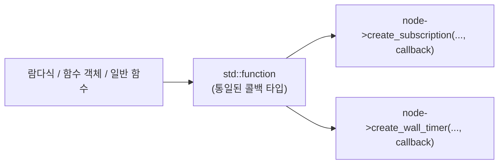
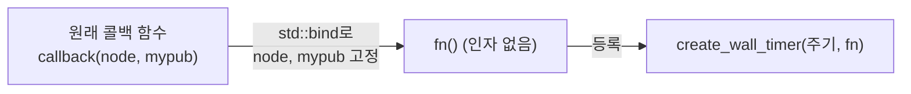
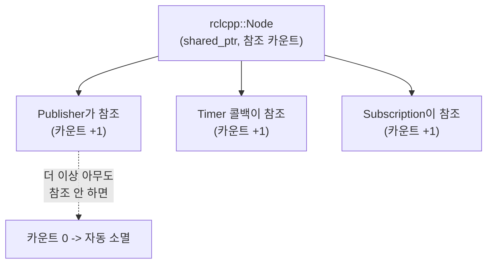

# 15\~17장. C++ 고급 기능 — 공부하기

> ⬆ [ROS2-Robotics-Practice로 돌아가기](https://github.com/2101080JUNGJINYOUNG/ROS2-Robotics-Practice)  ·  📝 [실습 문제 풀어보기](./문제.md)  ·  📚 [공부 목차](../README.md)

18\~20장(rclcpp) 코드를 보면 콜백 함수가 람다식, `std::bind`, 스마트 포인터로 가득 차 있습니다. 이 챕터의 문법을 미리 익혀두지 않으면 rclcpp 코드가 왜 이렇게 복잡한지 이해가 안 됩니다. 반대로 여기를 잡으면 18\~20장, 24\~25장 코드가 술술 읽힙니다.

## 목차

- [15장. 람다식과 std::function](#15장--람다식과-stdfunction)
- [16장. std::bind와 시간 리터럴](#16장--stdbind와-시간-리터럴)
- [17장. 스마트 포인터](#17장--스마트-포인터)
- [스스로 확인하는 질문](#스스로-확인하는-질문)

## 15장 — 람다식과 std::function

**일반 함수 vs 람다식**: 일반 함수는 이름을 붙여 미리 정의해두고 나중에 그 이름으로 호출합니다. 람다식(lambda expression)은 이름 없이 그 자리에서 즉석으로 만드는 함수입니다.

```cpp
auto add = [](int a, int b) { return a + b; }; // 이름 없는 함수(람다식)를 만들어 add 변수에 저장
int result = add(3, 4); // add를 일반 함수처럼 호출 -> result는 7
```

람다식의 큰 장점은 **캡처(capture)** 입니다. 대괄호 `[]` 안에 캡처할 변수를 적으면, 람다 밖 변수를 람다 안에서 그대로 쓸 수 있습니다.

```cpp
int base = 10;
auto addBase = [base](int x) { return x + base; }; // base를 값으로 캡처 (람다 안에서는 복사본)
auto addBaseRef = [&base](int x) { return x + base; }; // base를 참조로 캡처 (원본 base를 그대로 참조)
```

**`std::function`**: 일반 함수, 함수 객체, 람다식은 모두 "호출 가능한 것(callable)"이지만 타입이 서로 다릅니다. `std::function`은 이 서로 다른 형태를 하나의 통일된 타입으로 담을 수 있는 "함수를 담는 상자"입니다.

```cpp
std::function<int(int, int)> calculator; // int, int를 받아 int를 반환하는 함수를 담을 상자 선언
calculator = [](int a, int b) { return a + b; }; // 덧셈 람다를 상자에 대입
calculator = [](int a, int b) { return a - b; }; // 뺄셈 람다로 교체 (같은 상자, 다른 내용물)
```

> [!NOTE]
> 함수 포인터도 비슷하지만 캡처가 있는 람다(클로저)를 담을 수 없다는 한계가 있습니다. `std::function`은 캡처 유무와 관계없이 전부 담을 수 있어 더 안전하고 유연합니다.

rclcpp의 콜백 등록(`create_subscription`, `create_wall_timer`)은 내부적으로 이 `std::function`을 매개변수 타입으로 받습니다.



## 16장 — std::bind와 시간 리터럴

**`std::bind`**: 어떤 함수의 일부 인자를 미리 고정해서, 인자가 더 적은 새로운 함수를 만들어주는 도구입니다.

```cpp
bool isGreaterThan(int value, int threshold) { return value > threshold; } // 인자 2개짜리 원래 함수

// value 자리는 나중에 채워지도록(_1) 남겨두고, threshold는 50으로 미리 고정
auto isGreaterThan50 = std::bind(isGreaterThan, std::placeholders::_1, 50);
int count = std::count_if(vec.begin(), vec.end(), isGreaterThan50); // vec 안에서 50보다 큰 값의 개수
```

`std::placeholders::_1`은 "나중에 호출할 때 채워질 자리"라는 뜻의 자리표시자입니다. rclcpp에서는 이렇게 쓰입니다.

```cpp
// callback(node, mypub) 형태를, 인자 없이 fn() 만으로 호출 가능하게 고정
std::function<void()> fn = std::bind(callback, node, mypub);
```

타이머·구독 콜백은 ROS2 내부에서 정해진 형태(인자 없음, 또는 메시지 하나만 받음)로만 호출됩니다. 실제 콜백 안에서는 `node`나 `mypub` 같은 추가 정보도 필요한데, `std::bind`로 미리 "고정"해두면 ROS2가 기대하는 형태로 넘길 수 있습니다.

**`std::bind`의 실제 선언과 `&&`의 의미**

`std::bind`의 표준 선언은 다음과 같습니다.

```cpp
template< class F, class... Args >
/*unspecified*/ bind(F&& f, Args&&... args);
```

여기 나오는 `&&`는 두 가지 개념이 겹쳐 있습니다.

1. **우측값(R-value) 참조**: `&&`는 원래 임시 객체나 리터럴 상수처럼 이름 없는 "우측값"만 참조할 수 있는 문법입니다. 예를 들어 `int&& r = 10;`은 되지만, 변수를 가리키는 `int i = 5; int&& r = i;`는 컴파일 에러입니다. 이 성질은 임시 객체의 소유권을 복사 없이 "이동(move)"시켜 성능을 높이는 이동 의미론(Move Semantics)의 핵심입니다.
2. **전달 참조(Forwarding Reference)**: 하지만 `std::bind`처럼 **템플릿 타입(`F`, `Args`)과 함께 쓰인 `&&`**는 조금 다르게 동작합니다 — 이를 전달 참조라 부릅니다. 인자로 좌측값(변수 등)이 들어오면 그 매개변수 타입은 좌측값 참조(`&`)로 추론되고, 우측값(임시 객체 등)이 들어오면 우측값 참조(`&&`)로 추론됩니다. 즉 `F&& f`는 "좌측값이 오든 우측값이 오든 다 받을 수 있는" 만능 매개변수가 됩니다.

이 덕분에 `std::bind`는 전달받은 인자를 원래의 값 속성(좌측값/우측값) 그대로 내부 함수에 그대로 넘길 수 있습니다(perfect forwarding) — 불필요한 복사를 피하고 효율을 높이는 것이 목적입니다. rclcpp 콜백 등록에서 `std::bind(callback, node, mypub)`처럼 쓸 때, `node`나 `mypub` 같은 인자가 어떤 형태로 전달되든 이 매커니즘 덕분에 그대로 안쪽 콜백에 전달됩니다.



**시간 리터럴**: `using namespace std::chrono_literals;`를 선언하면 `100ms`, `2s`처럼 숫자 뒤에 단위를 붙여 시간을 표현할 수 있습니다.

```cpp
using namespace std::chrono_literals; // ms, s 같은 시간 단위 리터럴 사용 선언
auto timer = node->create_wall_timer(100ms, callback); // 100밀리초마다 callback 호출하는 타이머 생성
auto total = 1s + 250ms; // 시간 리터럴끼리 연산 (1.25초)
```

이 문법은 18\~20장의 `create_wall_timer(100ms, ...)`처럼 타이머 주기 지정에 그대로 쓰입니다.

## 17장 — 스마트 포인터

> [!WARNING]
> **문제 상황(raw 포인터)**: `new`로 할당한 메모리는 반드시 `delete`로 해제해야 하는데, 코드가 복잡해지면 깜빡하기 쉽고(메모리 누수), 이미 해제된 메모리를 또 참조하는 실수(댕글링 포인터)도 생깁니다.

**`unique_ptr`**: 하나의 소유자만 가질 수 있는 스마트 포인터. 스코프를 벗어나면 자동으로 `delete`가 호출됩니다. 소유권을 넘기려면 `std::move`를 씁니다.

> [!IMPORTANT]
> `unique_ptr`는 복사가 금지되어 있습니다 — 소유자가 둘이 될 수 없다는 것이 핵심 규칙이며, 복사를 시도하면 컴파일 에러가 납니다. 소유권을 넘기고 싶으면 반드시 `std::move`로 "이동"해야 합니다.

```cpp
std::unique_ptr<CTest> ptr1 = std::make_unique<CTest>(); // CTest 객체를 힙에 생성, ptr1이 유일한 소유자
std::unique_ptr<CTest> ptr2 = std::move(ptr1); // 소유권을 ptr2로 이동, ptr1은 비어있음(nullptr)
```

**`shared_ptr`**: 여러 곳에서 동시에 소유할 수 있는 스마트 포인터로, 내부적으로 참조 카운트(reference count)를 유지합니다. 카운트가 0이 되는 순간 객체의 소멸자가 호출되고 메모리가 해제됩니다.

```cpp
auto p1 = std::make_shared<CTest>(); // CTest 객체 생성, 참조 카운트 1
{
auto p2 = p1; // p1과 같은 객체를 가리킴, 참조 카운트 2
} // 블록을 벗어나며 p2 소멸 -> 참조 카운트 1
// p1도 소멸하면 참조 카운트 0 -> 소멸자 호출, 메모리 해제
```

rclcpp에서 노드를 만들 때 항상 `std::make_shared<rclcpp::Node>("이름")`을 쓰는 이유가 이것입니다. 노드 객체는 콜백, 퍼블리셔, 타이머 등 여러 곳에서 동시에 참조해야 하는데, `shared_ptr`를 쓰면 아무도 더 이상 참조하지 않을 때 자동으로 메모리가 정리되므로 직접 `delete`를 신경 쓸 필요가 없습니다.



## 스스로 확인하는 질문

- 람다식과 일반 함수의 차이, 캡처가 왜 필요한지 설명할 수 있는가?
- `std::function`이 함수 포인터보다 나은 점은?
- `std::bind`가 rclcpp 콜백 등록에서 실제로 어떤 문제를 해결해주는가?
- `unique_ptr`와 `shared_ptr`의 차이(소유자 수)를 설명할 수 있는가?
- rclcpp 노드가 왜 항상 `shared_ptr`로 관리되는지 설명할 수 있는가?

---

⬆ [ROS2-Robotics-Practice로 돌아가기](https://github.com/2101080JUNGJINYOUNG/ROS2-Robotics-Practice)  ·  📝 [실습 문제 풀어보기](./문제.md)  ·  ➡ [다음 장: 18\~20장. ROS2 rclcpp](../18_19_20_ROS2_rclcpp/README.md)  ·  📚 [공부 목차](../README.md)
