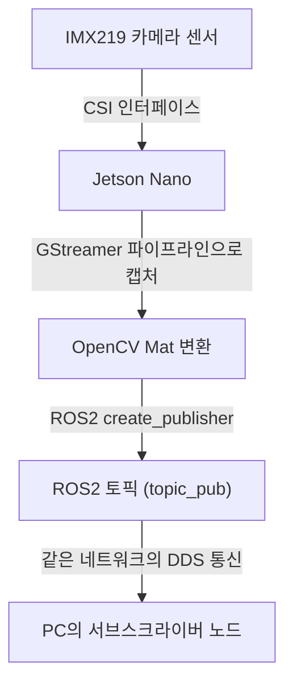
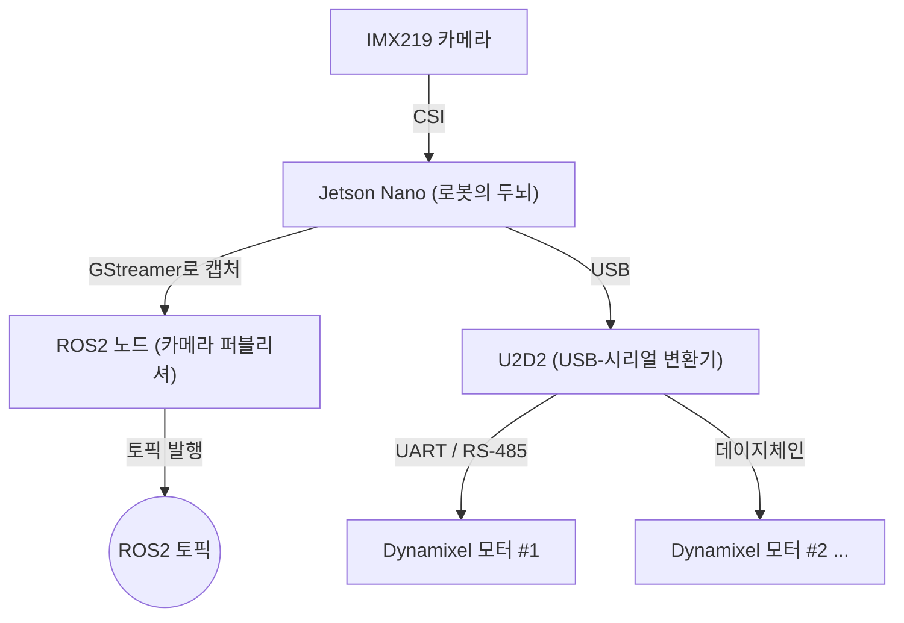

# 22장. 실습 로봇 소개 — 공부하기

> ⬆ [ROS2-Robotics-Practice로 돌아가기](https://github.com/2101080JUNGJINYOUNG/ROS2-Robotics-Practice)  ·  📚 [공부 목차](../README.md)

실습에 쓰인 하드웨어를 조사하는 과제입니다. 24\~25장(다이내믹셀, 라인검출)에서 이 장비들이 실제로 코드에 등장하므로, 여기서 장비 역할을 정확히 알아두면 뒤 챕터 코드가 "왜 이런 장치 경로(`/dev/ttyUSB0`)나 GStreamer 파이프라인 문자열을 쓰는지" 자연스럽게 이해됩니다.

## 목차

- [1. Jetson Nano](#1-jetson-nano--로봇의-두뇌)
- [2. IMX219 카메라](#2-imx219-카메라--로봇의-눈)
- [3. CSI](#3-csicamera-serial-interface)
- [4. GStreamer](#4-gstreamer--영상-파이프라인)
- [5. Dynamixel](#5-dynamixel--로봇의-관절근육)
- [6. U2D2](#6-u2d2--컴퓨터와-모터를-잇는-통역기)
- [7. 장비 연결 구조 한눈에 보기](#7-장비들이-서로-어떻게-연결되는지-한눈에-정리)
- [8. 스스로 확인하는 질문](#8-스스로-확인하는-질문)

## 1. Jetson Nano — 로봇의 "두뇌"

엔비디아(NVIDIA)가 만든 소형 임베디드 보드로, 로봇/드론처럼 크기와 전력이 제한된 장치에 AI 연산 능력(GPU)을 넣기 위해 설계되었습니다.

- 128코어 Maxwell GPU + 쿼드코어 ARM Cortex-A57 CPU + 4GB LPDDR4 메모리(대역폭 약 25.6GB/s)
- 데스크톱 PC보다 훨씬 저전력·소형이면서도, 카메라 영상을 실시간 처리(25장 라인검출의 OpenCV 연산)할 만한 GPU 성능을 제공하는 것이 핵심 특징
- 이 실습에서는 ROS2 노드들을 실제로 실행하는 로봇의 메인 컴퓨터 역할을 합니다.

## 2. IMX219 카메라 — 로봇의 "눈"

소니(Sony)의 이미지 센서로, Jetson Nano와 흔히 쓰이는 카메라 모듈(Raspberry Pi Camera Module V2 등)에 탑재됩니다.

- 해상도 3280×2464(약 800만 화소), 픽셀 크기 1.12µm
- 광각(wide) 버전은 대각선 175°까지 촬영 가능해 로봇 앞의 넓은 시야 확보
- 일반 USB 웹캠이라면 리눅스에서 `/dev/video0` 장치 파일로 인식되지만, 이 실습의 IMX219는 CSI 카메라라서 이 경로 대신 24장에서 보게 될 GStreamer 파이프라인 문자열로 열립니다.

## 3. CSI(Camera Serial Interface)

카메라 센서와 메인 프로세서를 연결하는 물리적 인터페이스 규격입니다.

- 여러 데이터 레인(lane)과 가상 채널을 지원해, 고해상도 이미지 센서가 필요로 하는 높은 대역폭을 안정적으로 전송
- IMX219 카메라는 이 CSI 포트를 통해 Jetson Nano에 직접 연결됩니다.

## 4. GStreamer — 영상 파이프라인

리눅스 계열에서 널리 쓰이는 오픈소스 멀티미디어 프레임워크로, 카메라 캡처 → 인코딩/디코딩 → 화면 출력/네트워크 전송 과정을 "파이프라인" 형태로 구성합니다.

24장(다이내믹셀 원격조작)의 `jetson/pub.cpp`가 "GStreamer로 Jetson 카메라 영상을 읽어 토픽으로 발행"한다는 것은, GStreamer 파이프라인으로 카메라 하드웨어에서 영상을 가져와 OpenCV `Mat` 형태로 변환해 ROS2 토픽에 실어 보낸다는 뜻입니다.

카메라 영상이 실제 하드웨어에서 다른 컴퓨터의 구독자까지 전달되는 전체 경로는 다음과 같습니다.



> [!NOTE]
> CSI 카메라는 일반 USB 카메라처럼 `VideoCapture(0)`로 바로 열리지 않는 경우가 많습니다. 그래서 Jetson 계열 보드에서는 GStreamer 파이프라인 문자열(예: `nvarguscamerasrc ! ... ! appsink`)을 `VideoCapture`에 직접 넘겨서 여는 방식이 일반적으로 쓰입니다.

## 5. Dynamixel — 로봇의 "관절/근육"

로보티즈(ROBOTIS)의 스마트 서보 모터 시리즈입니다.

- 모터 자체에 감속기, 위치/속도/토크 제어기, 통신 드라이버, 엔코더(센서)가 모두 통합되어 있습니다.
- 컴퓨터가 시리얼 통신으로 "몇 번 모터를 이 속도로 회전시켜라" 명령을 보내면, 모터 내부 제어기가 알아서 실제 회전으로 변환합니다.
- 24장의 `ADDR_MX_GOAL_POSITION`, `ADDR_XL_GOAL_VELOCITY` 같은 상수는 모터 내부 "제어 테이블(control table)" 주소를 가리키며, Dynamixel SDK가 이 주소에 값을 써서 모터를 제어합니다.

## 6. U2D2 — 컴퓨터와 모터를 잇는 통역기

로보티즈가 만든 USB-시리얼(UART) 변환 장치로, Jetson Nano(또는 PC)의 USB 포트와 Dynamixel 모터의 통신 포트(UART/RS-485)를 연결합니다.

- 리눅스에서는 `/dev/ttyUSB0` 장치 파일로 인식 — 24장 코드의 `#define DEVICENAME "/dev/ttyUSB0"`가 이 장치를 가리킵니다.
- 컴퓨터 입장에서는 U2D2를 통해 하나의 시리얼 포트에 여러 대의 Dynamixel 모터가 데이지체인(daisy chain)으로 연결된 것처럼 통신합니다.

## 7. 장비들이 서로 어떻게 연결되는지 한눈에 정리

```
IMX219 카메라 --(CSI)--> Jetson Nano --(GStreamer로 캡처)--> ROS2 노드 --(토픽 발행)
Jetson Nano --(USB)--> U2D2 --(UART)--> Dynamixel 모터 (여러 대 데이지체인 연결 가능)
```

같은 내용을 하드웨어 연결도로 표현하면 다음과 같습니다.



> [!TIP]
> 이 그림을 기억해두면 24장(다이내믹셀 제어) 코드에서 왜 `/dev/ttyUSB0` 같은 장치 파일 경로가, 카메라 쪽에서는 왜 장치 경로 대신 GStreamer 파이프라인 문자열이 등장하는지 자연스럽게 이해됩니다.

## 8. 스스로 확인하는 질문

- Jetson Nano가 일반 PC와 비교해 로봇에 적합한 이유는?
- CSI 카메라와 USB 카메라의 차이는?
- Dynamixel 모터가 "일반 모터"와 다른 점은?
- U2D2는 정확히 어떤 역할을 하는 장치인가?

---

⬆ [ROS2-Robotics-Practice로 돌아가기](https://github.com/2101080JUNGJINYOUNG/ROS2-Robotics-Practice)  ·  📝 [실습 문제 풀어보기](./문제.md)  ·  ➡ [다음 장: 23장. ROS2 카메라 (네트워크 설정 확인)](../23_ROS2카메라/README.md)  ·  📚 [공부 목차](../README.md)
