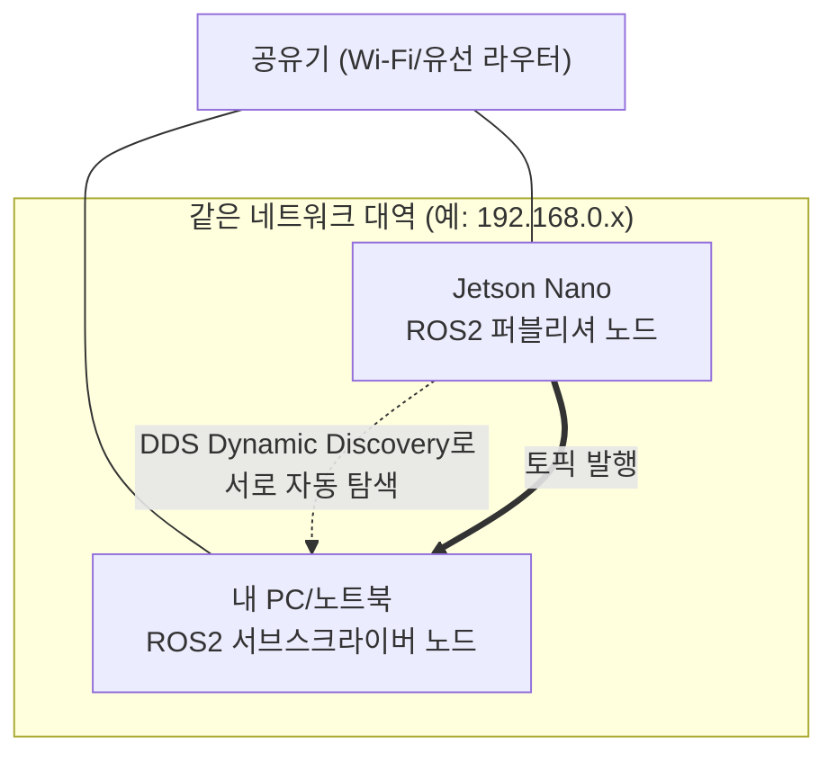

# 23장. ROS2 카메라 (네트워크 설정 확인) — 공부하기

> ⬆ [ROS2-Robotics-Practice로 돌아가기](https://github.com/2101080JUNGJINYOUNG/ROS2-Robotics-Practice)  ·  📝 [실습 문제 풀어보기](./문제.md)  ·  📚 [공부 목차](../README.md)

이 챕터는 이름과 달리 카메라 코드를 다루지 않고, 로봇에 연결된 여러 장치(Jetson Nano, 내 PC 등)의 IP 주소를 확인해서 같은 네트워크에 있는지 점검하는 실습입니다. ROS2에서 여러 컴퓨터에 걸쳐 노드를 실행할 때 반드시 필요한 사전 점검 작업입니다.

## 목차

- [1. 왜 네트워크 설정을 확인해야 하는가](#1-왜-네트워크-설정을-확인해야-하는가)
- [2. IP 주소를 확인하는 명령어](#2-ip-주소를-확인하는-명령어)
- [3. 같은 네트워크인지 판단하는 법](#3-ip-주소로-같은-네트워크인지-판단하는-법)
- [4. 확인이 실패하면 어떻게 되는가](#4-이-확인이-실패하면-어떻게-되는가)
- [5. 스스로 확인하는 질문](#5-스스로-확인하는-질문)

## 1. 왜 네트워크 설정을 확인해야 하는가

03\~05장에서 배운 것처럼 ROS2(DDS)는 네트워크를 통해 노드들이 서로를 자동으로 찾습니다(Dynamic Discovery). 이 자동 검색은 기본적으로 "같은 네트워크 대역"에 있는 장치들 사이에서만 동작합니다.

- Jetson Nano와 내 노트북이 같은 와이파이 공유기에 연결되어야 서로의 노드를 찾을 수 있습니다.
- 서로 다른 네트워크에 있다면 IP 주소가 있어도 서로를 발견하지 못해 토픽 통신이 안 됩니다.

두 장치가 같은 네트워크에서 서로의 ROS2 노드를 자동으로 찾아 토픽을 주고받는 과정을 그림으로 보면 다음과 같습니다.



> [!IMPORTANT]
> 그래서 실제 통신을 시작하기 전에 "두 장치가 같은 네트워크에 있는가"를 먼저 확인하는 것이 정석적인 순서입니다.

## 2. IP 주소를 확인하는 명령어

리눅스(Jetson Nano, Ubuntu):

```bash
# 네트워크 인터페이스와 IP 주소를 확인하는 구버전 명령어(대부분의 배포판에 기본 설치됨)
ifconfig
# 또는 최신 배포판에서는 아래 명령을 사용 (net-tools 대신 iproute2 패키지 제공)
ip addr
```

`eth0`(유선랜), `wlan0`(무선랜) 같은 인터페이스별로 `inet 192.168.0.15` 같은 줄이 나오는데, `inet` 뒤의 숫자가 해당 장치의 IPv4 주소입니다.

윈도우:

```bat
:: 윈도우에서 네트워크 어댑터별 IP 주소, 서브넷 마스크, 기본 게이트웨이를 확인하는 명령어
ipconfig
```

`IPv4 주소` 항목에 표시되는 값이 해당 PC의 IP 주소입니다.

## 3. IP 주소로 같은 네트워크인지 판단하는 법

- IPv4 주소는 `192.168.0.15`처럼 점으로 구분된 4개의 숫자로 이루어져 있습니다.
- 가정/사무실 네트워크에서 흔한 서브넷 설정에서는 앞의 3자리(`192.168.0`)가 네트워크 대역, 마지막 1자리(`15`)가 그 안에서 각 장치를 구분하는 고유 번호(호스트 주소)입니다.
- `192.168.0.15`와 `192.168.0.23`처럼 앞 3자리가 같으면 같은 네트워크(같은 공유기), `192.168.0.15`와 `192.168.1.7`처럼 앞자리가 다르면 서로 다른 네트워크입니다.

이 챕터의 실습이 "여러 장치의 IP 주소 앞 3자리가 같은지 비교"하는 것도 이 원리를 직접 확인하는 과정입니다.

> [!NOTE]
> 여기서 설명한 "앞 3자리 비교"는 가장 흔한 가정용 네트워크 설정을 기준으로 한 간단한 어림짐작입니다. 정확한 판단 기준인 서브넷 마스크/CIDR 개념은 26장에서 다룹니다.

## 4. 이 확인이 실패하면 어떻게 되는가

> [!WARNING]
> IP 주소의 네트워크 대역이 다르면, 케이블이나 와이파이가 물리적으로 연결되어 있어도 두 장치는 서로 다른 네트워크에 속한 것이므로 ROS2 노드가 서로를 찾지 못합니다. 이럴 때는 두 장치를 같은 공유기(같은 와이파이)에 연결하거나, 네트워크 관리자에게 같은 서브넷을 할당받아야 합니다.

실습 중 "콘솔"로 표시된 부분들은 `ifconfig`로 확인한 실제 IP 주소를 서로 비교하면서, 앞자리가 일치해 같은 네트워크에 있음을 확인하는 과정을 기록한 것입니다.

## 5. 스스로 확인하는 질문

- 두 장치가 물리적으로 케이블/와이파이로 연결되어 있어도 ROS2 통신이 안 될 수 있는 이유는?
- IP 주소 `192.168.0.15`와 `192.168.0.42`가 같은 네트워크에 있다고 판단할 수 있는 근거는?
- 리눅스와 윈도우에서 IP 주소를 확인하는 명령어는 각각 무엇인가?

---

⬆ [ROS2-Robotics-Practice로 돌아가기](https://github.com/2101080JUNGJINYOUNG/ROS2-Robotics-Practice)  ·  📝 [실습 문제 풀어보기](./문제.md)  ·  ➡ [다음 장: 24장. ROS2 + Dynamixel(다이내믹셀) 제어](../24_ROS2다이내믹셀/README.md)  ·  📚 [공부 목차](../README.md)
