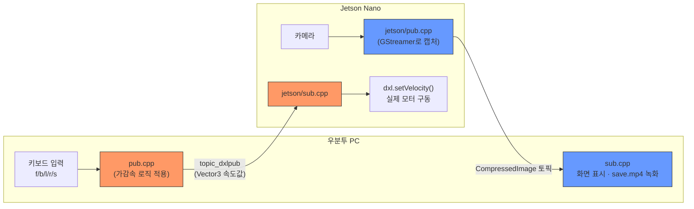

# 24장. ROS2 + Dynamixel(다이내믹셀) 제어 — 공부하기

> 🏠 [메인 저장소로 돌아가기](https://github.com/2101080JUNGJINYOUNG/ROS2-Robotics-Practice)  ·  📝 [실습 문제 풀어보기](./문제.md)

22장에서 배운 Dynamixel 모터를 실제로 ROS2 노드로 제어하는 실습입니다. 18\~20장(rclcpp 기본 문법)을 이해했다는 전제로 진행되며, 그 지식이 "실제 하드웨어 제어"에 어떻게 응용되는지가 핵심입니다.

## 목차

- [1. Dynamixel SDK란](#1-dynamixel-sdk란)
- [2. 제어 테이블 주소](#2-제어-테이블control-table-주소)
- [3. 위치 제어 vs 속도 제어](#3-위치-제어-vs-속도-제어)
- [4. 다이내믹셀2 — 원격 조작 구조](#4-다이내믹셀2--원격-조작teleoperation-구조)
- [5. 스스로 확인하는 질문](#5-스스로-확인하는-질문)

## 1. Dynamixel SDK란

로보티즈가 제공하는 공식 라이브러리로, U2D2(22장 참고)를 통해 Dynamixel 모터와 시리얼 통신을 주고받는 저수준 작업(포트 열기, 패킷 만들기, 값 읽고 쓰기)을 대신 처리해줍니다.

`다이내믹셀1/dxl.hpp`에는 `dynamixel::PortHandler`(통신 포트 관리)와 `dynamixel::PacketHandler`(모터에 보낼 명령 패킷을 만들고 해석) 두 객체가 SDK의 핵심 구성요소로 등장합니다.

## 2. 제어 테이블(Control Table) 주소

```cpp
#define ADDR_MX_TORQUE_ENABLE 24 // MX 시리즈: 토크 On/Off 스위치 주소 (1을 쓰면 켜짐, 0을 쓰면 꺼짐)
#define ADDR_MX_GOAL_POSITION 30 // MX 시리즈: 목표 위치(각도) 값을 쓰는 주소
#define ADDR_XL_GOAL_VELOCITY 104 // XL 시리즈: 목표 속도 값을 쓰는 주소
```

Dynamixel 모터 내부에는 "몇 번 주소에 어떤 값을 쓰면 어떤 동작을 한다"는 규격(제어 테이블)이 정해져 있습니다.

- 24번 주소에 1을 쓰면 토크(모터에 힘을 주는 기능)가 켜집니다.
- 30번 주소에 원하는 각도 값을 쓰면 그 위치로 이동합니다.
- 모델(MX-12W, XL430 등)마다 주소 값이 달라, 코드에 `MX_...`와 `XL_...` 두 세트가 따로 정의되어 있고 `DXL_MODEL` 매크로로 어떤 모델을 쓸지 선택합니다.

> [!IMPORTANT]
> 제어 테이블 주소는 모델(MX-12W, XL430 등)마다 다릅니다. 반드시 사용 중인 모터의 데이터시트에서 정확한 주소를 확인하고 `DXL_MODEL` 매크로를 알맞게 설정하세요. 주소를 잘못 쓰면 엉뚱한 기능이 켜지거나 통신 오류가 날 수 있습니다.

즉 `Dxl` 클래스의 함수들(`open`, `setVelocity` 등)은 결국 내부적으로 "이 주소에 이 값을 써라"는 SDK 함수 호출로 변환됩니다.

## 3. 위치 제어 vs 속도 제어

Dynamixel은 여러 동작 모드를 지원합니다.

- **위치 제어(Position Control)**: "몇 도 각도로 이동해라"처럼 목표 각도를 지정 (`ADDR_..._GOAL_POSITION`)
- **속도 제어(Velocity Control)**: "이 속도로 계속 회전해라"처럼 목표 속도를 지정 (`ADDR_..._GOAL_VELOCITY`) — 바퀴처럼 계속 회전해야 하는 경우(이 실습의 로봇 바퀴 구동) 이 모드를 씁니다.

`다이내믹셀1/main.cpp`의 `mx.setVelocity(vel1, vel2)`가 왼쪽/오른쪽 모터의 속도를 각각 지정하는 부분이고, `vel1`, `vel2`를 서서히 증가시켰다가 감소시키는 것은 모터의 가속/감속을 부드럽게 만들기 위한 로직입니다.

> [!WARNING]
> 모터에 갑자기 최고 속도를 명령하면 기계적으로 무리가 갈 수 있습니다(기어 파손, 전류 급증 등). 반드시 속도를 서서히 증가/감소시키는 가감속(ramp-up/ramp-down) 로직을 거쳐 목표 속도에 도달하도록 구현하세요.

## 4. 다이내믹셀2 — 원격 조작(Teleoperation) 구조

4개의 노드가 서로 다른 컴퓨터(Jetson Nano ↔ 사용자 PC/우분투)에서 실행되며 협력합니다. 18\~20장에서 배운 pub/sub 분리 패턴이 실제 로봇 제어로 확장된 형태입니다.

```
[우분투 PC]                          [Jetson Nano]
키보드 입력(f/b/l/r/s)                 카메라
   │ pub.cpp                          │ jetson/pub.cpp (GStreamer로 캡처)
   ▼ topic_dxlpub (속도값 발행)         ▼ CompressedImage 토픽 발행
   ──── 네트워크(같은 대역, 23장 참고) ────
   ▲ sub.cpp (영상 구독, 화면 표시/녹화) ▼
   │                                  jetson/sub.cpp
[영상 확인용, 모터 제어와는 무관]         (속도 토픽 구독 → dxl.setVelocity() 호출)
                                       │
                                실제 Dynamixel 모터 구동
```

아래 다이어그램은 위 구조를 두 개의 독립된 흐름(모터 구동 경로 / 카메라 영상 경로)으로 나누어 보여줍니다.



핵심은 **모터를 실제로 구동시키는 경로**(주황색)와 **카메라 영상 경로**(파란색)가 완전히 분리된 두 개의 흐름이라는 점입니다.

- **모터 구동 경로**: 우분투 PC의 `pub.cpp`가 키보드 입력(f=전진, b=후진, l=좌회전, r=우회전, s=정지)을 받아 가감속 로직을 적용한 속도 값을 `geometry_msgs::msg::Vector3` 형태로 `topic_dxlpub` 토픽에 발행하면, Jetson Nano의 `jetson/sub.cpp`가 이를 구독해 `dxl.setVelocity()`를 호출해 실제 모터를 돌립니다.
- **영상 경로**: Jetson Nano의 `jetson/pub.cpp`가 카메라 영상을 `CompressedImage` 토픽으로 발행하면, 우분투 PC의 `우분투/sub.cpp`가 이를 구독해 화면에 띄우고 `save.mp4`로 녹화합니다. 순수하게 "모니터링용"이며 모터 제어와는 직접적인 관련이 없습니다.

즉 "카메라를 보면서 조종한다"는 인상과 달리, 실제로는 키보드 입력 → 속도 토픽 발행 → 원격 노드의 구독/모터 구동으로 이어지는 순수한 원격 조작 구조이고, 카메라 영상은 별도의 병렬 스트림입니다. 이렇게 관심사를 분리해두면 카메라 쪽에 문제가 생겨도(영상이 끊겨도) 모터 제어 자체는 영향받지 않는다는 장점이 있습니다.

> [!TIP]
> 모터 구동 경로와 카메라 영상 경로를 분리해두면, 영상 쪽에 문제가 생기거나(화면이 끊기거나) `우분투/sub.cpp` 창을 닫아도 모터 제어 자체는 영향받지 않습니다. 이렇게 관심사를 분리하는 설계는 실제 로봇 시스템에서 안전성을 높이는 핵심 원칙입니다.

## 5. 스스로 확인하는 질문

- 제어 테이블(control table) 주소가 왜 모델마다 다르게 정의되어 있는가?
- 위치 제어와 속도 제어 중, 바퀴를 계속 굴리는 로봇에는 어느 쪽이 적합한가?
- 다이내믹셀2 실습에서 카메라 영상 경로와 모터 구동 경로가 왜 서로 분리되어 있는가?
- `우분투/sub.cpp`가 멈추면(화면 창을 닫으면) 실제로 로봇의 주행에 영향이 있는가, 없는가? 그 이유는?

---

🏠 [메인 저장소로 돌아가기](https://github.com/2101080JUNGJINYOUNG/ROS2-Robotics-Practice)
