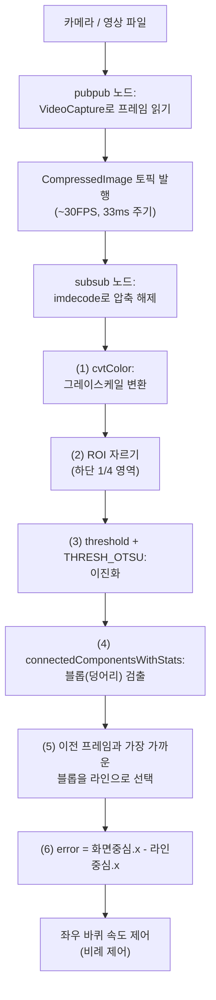

# 25장. ROS2 라인 검출 (Line Tracer) — 공부하기

> ⬆ [ROS2-Robotics-Practice로 돌아가기](https://github.com/2101080JUNGJINYOUNG/ROS2-Robotics-Practice)  ·  📚 [공부 목차](../README.md)  ·  📝 [실습 문제 풀어보기](./문제.md)

24장의 원격 조작 구조에서 "사람이 조종하던 것"을 "카메라 영상을 스스로 분석해서 판단하는 것"으로 바꾼 실습입니다. `pubpub`(영상 발행)과 `subsub`(영상 구독 + 라인 검출)로 나뉘며, 11장에서 배운 OpenCV 이진화 개념이 실전에서 라인 위치 계산까지 이어지는 과정이 핵심입니다.

## 목차

- [1. 전체 구조](#1-전체-구조-pubpub과-subsub)
- [1-1. 클래스 상속형 노드 패턴](#1-1-클래스-상속형-노드-패턴-campubnode)
- [2. 왜 CompressedImage를 쓰는가](#2-왜-compressedimage를-쓰는가)
- [3. 라인 검출 알고리즘 단계별 이해](#3-라인-검출-알고리즘-단계별-이해-visioncpp)
- [4. 데모 영상과 연결해서 보기](#4-데모-영상과-연결해서-보기)
- [5. 스스로 확인하는 질문](#5-스스로-확인하는-질문)

## 1. 전체 구조: pubpub과 subsub

```
[카메라 또는 영상 파일] → pubpub 노드 → CompressedImage 토픽 → subsub 노드 → 라인 위치 계산
```

- **`pubpub`**: OpenCV의 `VideoCapture`로 영상 소스(카메라의 GStreamer 파이프라인, 또는 테스트용 영상 파일)를 읽어 약 30FPS(33ms 주기)에 맞춰 `sensor_msgs::msg::CompressedImage`로 압축 발행합니다. 노드 이름, 토픽 이름, 영상 소스 경로를 생성자 인자로 받아 카메라나 파일을 바꿔가며 재사용 가능하도록 설계되어 있습니다.
- **`subsub`**: 압축 이미지 토픽을 구독해 실제 라인 검출 알고리즘을 수행합니다.

18\~20장에서 배운 "퍼블리셔/구독자 완전 분리" 패턴이 여기서는 "카메라 담당 노드"와 "영상 처리 담당 노드"로 나뉜 것입니다. 이렇게 분리해두면 카메라 노드는 그대로 두고 영상 처리 알고리즘만 따로 수정·재실행할 수 있습니다.

## 1-1. 클래스 상속형 노드 패턴 (`CamPubNode`)

18~24장까지는 전역 함수를 만들고 `std::bind(함수, ...)`로 노드 객체를 감싸는 방식(자유 함수 + `std::bind`)으로 노드를 작성했습니다. `pubpub`(`cam_pub_node.cpp`)부터는 다른 방식이 등장합니다 — **클래스가 `rclcpp::Node`를 상속**하는 패턴입니다.

```cpp
// cam_pub_node.hpp (개념 정리용 축약)
class CamPubNode : public rclcpp::Node   // rclcpp::Node를 상속받는 클래스
{
public:
    CamPubNode(const std::string & node_name,
               const std::string & topic_name,
               const std::string & video_source);
private:
    void publish_frame();   // 멤버 함수 콜백
    rclcpp::TimerBase::SharedPtr timer_;
    rclcpp::Publisher<sensor_msgs::msg::CompressedImage>::SharedPtr publisher_;
    cv::VideoCapture cap_;
};
```

두 방식의 차이:

- **자유 함수 + `std::bind` (18~24장)**: `auto node = std::make_shared<rclcpp::Node>("이름");`처럼 `rclcpp::Node`를 직접 생성한 뒤, 콜백은 별도의 전역 함수로 만들고 `std::bind(callback, node, ...)`처럼 필요한 값을 묶어서 등록합니다. 노드와 콜백 로직이 분리되어 있습니다.
- **클래스 상속(25장)**: `class CamPubNode : public rclcpp::Node`처럼 클래스 자체가 노드입니다. 생성자 안에서 `this`를 이용해 `create_wall_timer`나 `create_publisher`를 호출하고, 콜백도 그 클래스의 멤버 함수로 만들어 `std::bind(&CamPubNode::publish_frame, this)`처럼 **멤버 함수 포인터 + `this`**를 바인딩합니다. 노드가 가져야 할 상태(`cap_`, `publisher_` 등)를 멤버 변수로 자연스럽게 들고 다닐 수 있어, 카메라 핸들처럼 여러 개의 상태를 유지해야 하는 노드에 적합합니다.

> [!NOTE]
> `std::bind(&클래스::멤버함수, 객체포인터, 인자...)` 형태는 15~17장에서 배운 `std::bind`의 연장선입니다. 차이는 첫 번째 인자가 "멤버 함수 포인터"이고, 그 다음에 반드시 "그 함수를 호출할 객체(주로 `this`)"가 와야 한다는 점뿐입니다.

## 2. 왜 `CompressedImage`를 쓰는가

카메라 원본 영상(비압축)은 데이터 크기가 매우 커서 네트워크로 그대로 보내면 대역폭을 많이 차지하고 지연이 생길 수 있습니다. `CompressedImage`는 JPEG 등으로 압축된 형태로 이미지를 담는 표준 메시지 타입으로, 발행 쪽에서 압축해서 보내고 구독 쪽에서 다시 압축을 풀어(`imdecode`) 씁니다. `subsub`의 콜백에서 `imdecode(Mat(msg->data), IMREAD_COLOR)`가 바로 이 압축을 푸는 과정입니다.

> [!NOTE]
> 원본 영상을 압축 없이 그대로 네트워크로 보내면 대역폭을 많이 차지하고 지연(latency)이 발생합니다. `CompressedImage`처럼 압축된 메시지 타입을 쓰면 이런 문제를 줄일 수 있어, 25장의 카메라 영상 토픽도 이 방식을 사용합니다.

## 3. 라인 검출 알고리즘 단계별 이해 (`vision.cpp`)

`subsub`의 콜백 함수(`mysub_callback`)는 이미지 한 장이 들어올 때마다 다음 순서로 처리합니다. 전체 흐름은 아래 다이어그램과 같습니다.



**(1) 흑백 변환**: `cvtColor(frame, gray, COLOR_BGR2GRAY)`로 컬러 이미지를 흑백으로 바꿉니다. 라인의 색상 정보는 필요 없고 "밝은 배경과 어두운 선"의 명암 차이만 필요하므로, 흑백으로 바꾸면 이후 연산이 단순해집니다.

**(2) 관심 영역(ROI) 자르기**: `Rect roi(0, gray.rows * 3 / 4, gray.cols, gray.rows / 4)`로 이미지 아래쪽 1/4 영역만 잘라냅니다. 라인 트레이서는 로봇 바로 앞의 바닥 라인만 보면 되므로, 화면 위쪽(먼 곳, 배경)은 분석할 필요가 없습니다. 관심 영역만 잘라 처리하면 연산량이 줄어 처리 속도가 빨라집니다.

**(3) 이진화(Thresholding)**: `threshold(resizedBinary, binary, 0, 255, THRESH_BINARY | THRESH_OTSU)`로 흑백 이미지를 "검은색(0) 또는 흰색(255)"인 이진 이미지로 바꿉니다. `THRESH_OTSU`는 Otsu 알고리즘으로, 기준값(threshold)을 사람이 직접 정하지 않아도 이미지의 밝기 분포를 분석해 자동으로 최적의 경계값을 찾아줍니다. 조명이 바뀌어도 어느 정도 안정적으로 라인과 배경을 구분할 수 있는 이유가 여기에 있습니다. 이 이진화 개념은 11장(CMake+OpenCV) 실습과 동일한 원리입니다.

> [!TIP]
> `THRESH_OTSU`를 사용하면 조명이 바뀔 때마다 임계값을 사람이 직접 조정할 필요 없이, 이미지의 밝기 분포를 분석해 자동으로 최적값을 찾아줍니다. 고정된 threshold 값을 하드코딩하면 조명이 바뀌는 실제 환경에서 쉽게 라인 검출이 실패합니다.

**(4) 연결 요소 검출(Connected Components)**: `connectedComponentsWithStats`는 이진 이미지에서 서로 붙어있는 픽셀 덩어리들을 각각 하나의 "덩어리(blob)"로 묶어, 각 덩어리의 위치·크기·중심점을 계산해줍니다. 라인이 이진화된 이미지에서 하나의 덩어리로 나타나므로, 이 함수로 "라인처럼 보이는 덩어리가 몇 개 있고 어디에 있는지"를 알아낼 수 있습니다.

**(5) 로봇이 따라갈 라인 선택**: 덩어리가 여러 개 검출될 수 있으므로(노이즈, 갈림길 등), 다음 우선순위로 하나를 선택합니다.

- 첫 프레임: 화면 중앙에 가장 가까운 덩어리 선택
- 이후 프레임: 직전 프레임에서 선택했던 위치에서 가장 가까운 덩어리 선택 (단, 거리가 `MAX_DISTANCE`를 넘으면 직전 위치를 그대로 유지)

"이전 프레임과의 연속성"을 이용하는 이유는, 라인이 갈라지거나 순간적으로 다른 물체가 검출되어도 로봇이 엉뚱한 방향으로 튀지 않고 부드럽게 원래 라인을 계속 추적하게 하기 위해서입니다.

> [!IMPORTANT]
> 라인이 여러 개 검출되면(노이즈, 갈림길 등) 첫 프레임 이후로는 이전 프레임과 가장 가까운 블롭을 선택하고, 거리가 `MAX_DISTANCE`를 넘으면 직전 위치를 그대로 유지합니다. 이 로직이 없으면 노이즈나 다른 물체 때문에 로봇이 갑자기 엉뚱한 방향으로 튈 수 있습니다.

**(6) 에러(error) 계산**: `error = centerOfImage.x - closestCenter.x`로, "화면 중심 x좌표"와 "선택된 라인 중심의 x좌표" 차이를 계산합니다. 0이면 로봇이 라인 정중앙에 있다는 뜻이고, 양수/음수에 따라 라인이 화면 중심의 왼쪽/오른쪽에 있다는 것을 의미합니다. 이 `error` 값이 바로 실제 라인 트레이서 로봇에서 "좌우 바퀴 속도를 어떻게 조절할지" 결정하는 제어 입력값(비례 제어)으로 쓰입니다.

**(7) 처리 주기 맞추기**: `gettimeofday`로 처리 시작/종료 시각을 재서 실제 걸린 시간(`elapsedMs`)을 계산하고, 목표 주기(`targetDelayMs = 30`, 약 30FPS)에서 이미 걸린 시간을 뺀 만큼만 `usleep`으로 대기합니다. 18\~20장의 `WallRate`와 목적은 같지만(일정 주기 유지), 영상 처리는 프레임마다 걸리는 시간이 들쭉날쭉할 수 있어 직접 시간을 재서 나머지 시간만 대기하는 방식을 씁니다.

아래는 위 (1)~(6) 단계를 하나의 흐름으로 정리한 의사코드(pseudo-code)입니다. 각 줄의 의미를 주석으로 달아두었으니, 실제 `vision.cpp`를 읽을 때 대조해보면 도움이 됩니다.

```cpp
void mysub_callback(const sensor_msgs::msg::CompressedImage::SharedPtr msg)
{
    // 압축된 JPEG 바이트 배열을 실제 컬러 이미지(Mat)로 복원
    Mat frame = imdecode(Mat(msg->data), IMREAD_COLOR);

    // (1) 컬러 정보는 버리고 명암 정보만 남김 → 이후 연산 단순화
    Mat gray;
    cvtColor(frame, gray, COLOR_BGR2GRAY);

    // (2) 화면 아래쪽 1/4만 관심 영역(ROI)으로 사용 → 연산량 감소
    Rect roi(0, gray.rows * 3 / 4, gray.cols, gray.rows / 4);
    Mat cropped = gray(roi);

    // (3) Otsu 알고리즘으로 임계값을 자동 결정해 이진화(흑/백)
    Mat binary;
    threshold(cropped, binary, 0, 255, THRESH_BINARY | THRESH_OTSU);

    // (4) 흰색(또는 검은색) 픽셀 덩어리를 라벨링하고, 각 덩어리의 통계(위치/크기/중심) 계산
    Mat labels, stats, centroids;
    int numLabels = connectedComponentsWithStats(binary, labels, stats, centroids);

    // (5) 이전 프레임 위치와 가장 가까운 덩어리를 이번 프레임의 "라인"으로 선택
    Point closestCenter = findClosestBlob(centroids, previousCenter, MAX_DISTANCE);

    // (6) 화면 중심과 라인 중심의 x좌표 차이 = 조향에 쓸 에러값
    double error = centerOfImage.x - closestCenter.x;

    // error를 비례 제어에 사용해 좌우 바퀴 속도를 계산하고 setVelocity()로 전달
    applyProportionalControl(error);
}
```

## 4. 데모 영상과 연결해서 보기

리포지토리에 링크된 데모 영상(In/Out Line Tracer)을 보면서, 로봇이 라인에서 벗어나려 할 때 방향을 다시 트는 순간이 바로 위 5\~6단계(가장 가까운 라인 선택 → error 계산)가 매 프레임 반복되고 있는 순간이라는 것을 연결해서 이해하면 코드가 훨씬 와닿습니다.

## 5. 스스로 확인하는 질문

- 컬러 이미지를 그레이스케일로 바꾸는 이유는?
- ROI(관심 영역)만 잘라서 처리하는 이유는?
- `THRESH_OTSU`가 일반적인 고정 threshold 값보다 나은 점은?
- 라인이 여러 개 검출될 때, 코드가 "이전 프레임과 가장 가까운 것"을 선택하는 이유는?
- `error` 값이 실제로 로봇 제어에서 어떤 의미를 가지는가?

---

⬆ [ROS2-Robotics-Practice로 돌아가기](https://github.com/2101080JUNGJINYOUNG/ROS2-Robotics-Practice)  ·  📚 [공부 목차](../README.md)  ·  📝 [실습 문제 풀어보기](./문제.md)  ·  ➡ [다음 장: 26장. 네트워크와 개발환경 구축](../26_네트워크와개발환경구축/README.md)
