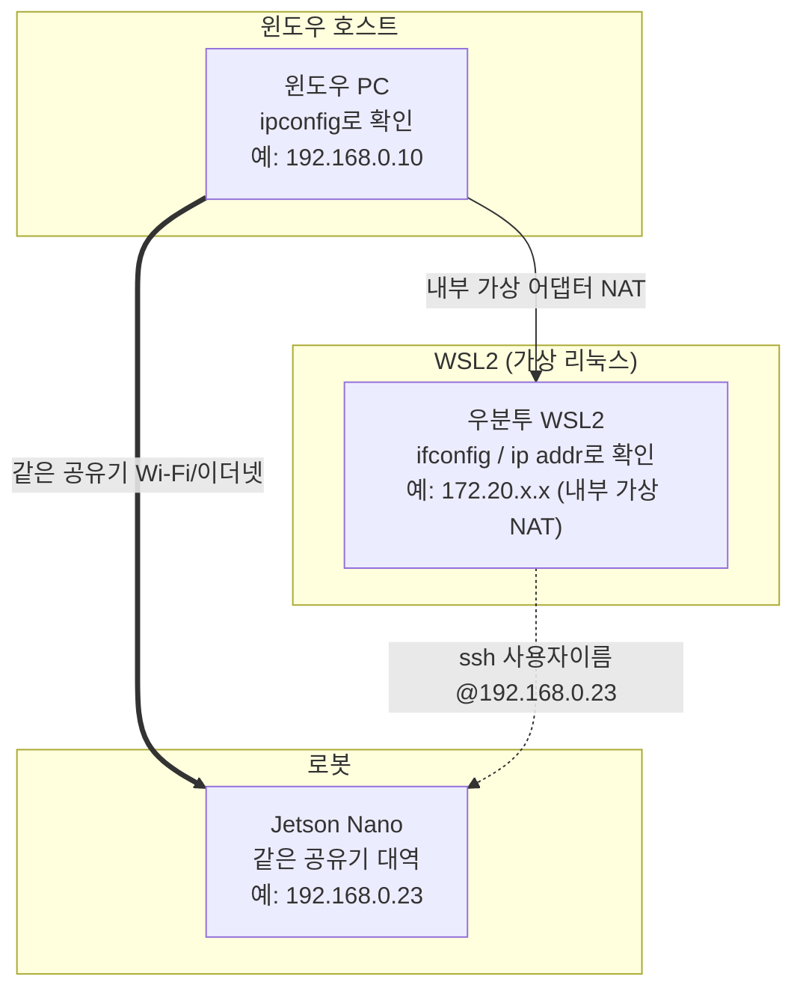

# 26장. 네트워크와 개발환경 구축 — 공부하기

> 🏠 [메인 저장소로 돌아가기](https://github.com/2101080JUNGJINYOUNG/ROS2-Robotics-Practice)  ·  📝 [실습 문제 풀어보기](./문제.md)

WSL2와 리눅스 네트워크의 기초를 다루는 챕터입니다. 23장(IP 대역 비교)의 내용을 더 깊이 확장해서, 여기 개념들을 알면 23장의 "왜 앞 3자리가 같아야 같은 네트워크인가"도 더 정확히 설명할 수 있게 됩니다.

## 목차

- [1. WSL2란](#1-wsl2란)
- [2. IP 주소 확인: ipconfig vs ifconfig](#2-ip-주소-확인-ipconfig-vs-ifconfig)
- [3. SSH로 원격 접속하기](#3-ssh로-원격-접속하기)
- [4. TCP/IP 4계층 구조](#4-tcpip-4계층-구조)
- [4-1. IP주소, 도메인네임, DNS](#4-1-ip주소-도메인네임-dns)
- [4-2. 유니캐스트와 멀티캐스트](#4-2-유니캐스트와-멀티캐스트)
- [5. TCP vs UDP](#5-tcp-vs-udp)
- [6. ifconfig, netstat, ping 결과 읽는 법](#6-ifconfig-netstat--antup-ping-결과-읽는-법)
- [7. 서브넷 마스크](#7-서브넷-마스크와-같은-네트워크-판단-23장과-연결)
- [8. 사설 IP와 NAT](#8-사설-ip와-nat--왜-여러-장치가-인터넷을-같이-쓸-수-있는가)
- [9. 스스로 확인하는 질문](#9-스스로-확인하는-질문)

## 1. WSL2란

WSL(Windows Subsystem for Linux)은 윈도우 안에서 진짜 리눅스 커널을 돌릴 수 있게 해주는 기능입니다. WSL2는 실제 리눅스 커널을 가상 머신 형태로 포함하고 있어 WSL1보다 리눅스 네이티브에 가까운 동작(파일 시스템 성능, 네트워크 스택)을 제공합니다.

- 윈도우 PC에서 별도의 가상머신 프로그램 없이 WSL2만으로 우분투 환경을 띄워 ROS2를 실행할 수 있는 것도 이 기능 덕분입니다.
- WSL2는 내부적으로 별도의 가상 네트워크 어댑터를 쓰기 때문에, 윈도우 호스트와 WSL2 내부의 IP 주소가 서로 다르게 잡히는 경우가 많다는 점이 이 챕터의 SSH 실습과 연결됩니다.

> [!NOTE]
> 같은 물리 컴퓨터라도 윈도우가 보는 IP(`ipconfig`)와 WSL2 리눅스가 보는 IP(`ifconfig`)는 다를 수 있습니다. Jetson Nano나 다른 장치에 SSH로 접속할 때는 반드시 리눅스 쪽에서 확인한 IP를 기준으로 접속 대상을 판단하세요.

아래 다이어그램은 윈도우 PC, WSL2, Jetson Nano 사이의 네트워크 관계를 예시 IP와 함께 보여줍니다.



## 2. IP 주소 확인: `ipconfig` vs `ifconfig`

- **윈도우**: `ipconfig` — 이더넷/와이파이 어댑터별 IPv4 주소를 보여줍니다.
- **리눅스(WSL2 포함)**: `ifconfig` (또는 최신 배포판의 `ip addr`) — `eth0`, `wlan0` 같은 인터페이스별 IP 주소를 보여줍니다.

같은 물리적 컴퓨터 안에서도 "윈도우가 보는 IP"와 "WSL2 리눅스가 보는 IP"가 다를 수 있는데, 이는 WSL2가 내부적으로 NAT을 통해 별도의 가상 서브넷을 쓰기 때문입니다.

## 3. SSH로 원격 접속하기

SSH(Secure Shell)는 네트워크를 통해 다른 컴퓨터의 터미널에 안전하게(암호화된 채널로) 접속하는 프로토콜입니다.

```bash
# 예: ssh ubuntu@192.168.0.23 처럼 "사용자이름@IP주소" 형식으로 접속
# 최초 접속 시 호스트 키 확인 메시지가 뜨면 yes 입력, 이후 비밀번호(또는 키) 입력
ssh 사용자이름@접속할IP주소
```

윈도우에서 WSL2로 SSH 접속하는 실습을 통해, "IP 주소만 알면 물리적으로 떨어진(또는 네트워크적으로 분리된) 시스템에 명령을 내릴 수 있다"는 것을 확인하게 됩니다. 이 개념은 24장(Jetson Nano 원격 조작), 25장(라인검출)처럼 로봇의 메인 컴퓨터인 Jetson Nano에 SSH로 접속해서 코드를 실행하는 작업의 기초가 됩니다.

## 4. TCP/IP 4계층 구조

1. **네트워크 접근 계층(Link)**: 이더넷 케이블, 와이파이 등 물리적으로 데이터를 주고받는 계층
2. **인터넷 계층(Internet)**: IP 주소로 목적지까지 경로를 찾아 전달(라우팅)하는 계층
3. **전송 계층(Transport)**: TCP/UDP처럼 데이터를 실제로 주고받는 방식을 정의하는 계층
4. **응용 계층(Application)**: HTTP, SSH처럼 실제 프로그램이 사용하는 통신 규약이 동작하는 계층

## 4-1. IP주소, 도메인네임, DNS

인터넷에서 컴퓨터를 찾아가는 방식은 스마트폰 연락처에 비유하면 이해가 쉽습니다.

- **IP 주소**: `172.217.26.14`처럼 컴퓨터/서버가 네트워크상에서 서로를 식별하는 고유한 숫자 주소입니다. 사람의 실제 "전화번호"에 해당합니다.
- **도메인 네임(Domain Name)**: `google.com`처럼 사람이 기억하고 입력하기 쉽게 만든 문자 주소입니다. 연락처에 저장된 "이름"에 해당합니다.
- **DNS(Domain Name System, 도메인 네임 시스템)**: 도메인 네임을 입력받으면 실제 IP 주소를 찾아 연결해주는 거대한 "주소록" 역할을 하는 시스템입니다. 이 덕분에 사용자는 복잡한 숫자를 외울 필요 없이 이름만으로 웹사이트에 접속할 수 있습니다.

## 4-2. 유니캐스트와 멀티캐스트

DDS/ROS2의 통신 방식을 이해하는 데도 쓰이는 개념으로, "누구에게 데이터를 보내는가"에 따라 통신 방식이 나뉩니다.

- **유니캐스트(Unicast)**: 한 명의 송신자가 특정 한 명의 수신자에게만 데이터를 보내는 1:1 통신입니다. 웹 서핑이나 파일 다운로드처럼 특정 서버와 내 컴퓨터가 서로에게만 데이터를 주고받는 대부분의 통신이 여기에 해당합니다.
- **멀티캐스트(Multicast)**: 한 명의 송신자가 특정 그룹에 속한 여러 수신자에게 동시에 데이터를 보내는 1:N 통신입니다. 데이터를 받고 싶은 사용자만 그룹에 가입하고, 송신자는 그룹을 대상으로 한 번만 보내면 가입된 모두가 받습니다. 모든 사람에게 보내는 브로드캐스트와 달리, 관심 있는 대상에게만 전달된다는 점이 특징입니다.

## 5. TCP vs UDP

- **TCP**: 연결을 맺고(3-way handshake) 데이터가 순서대로, 빠짐없이 도착했는지 확인하며 전송. 신뢰성은 높지만 오버헤드가 있어 상대적으로 느립니다. 파일 전송, 웹 페이지 로딩처럼 "하나라도 빠지면 안 되는" 통신에 적합.
- **UDP**: 연결 확인 없이 데이터를 보냅니다. 일부 유실될 수 있지만 빠르고 오버헤드가 적습니다. 실시간 영상 스트리밍처럼 "가끔 한 프레임 빠져도 최신 데이터가 더 중요한" 통신에 적합.

이 TCP/UDP 트레이드오프는 03\~04장에서 배운 QoS의 `reliable`(TCP에 가까운 개념)과 `best_effort`(UDP에 가까운 개념) 설정과 정확히 같은 맥락입니다 — 25장의 카메라 영상 토픽이 `best_effort()`를 쓰는 이유도 "영상은 조금 유실돼도 최신 프레임이 더 중요하다"는 같은 논리입니다.

## 6. `ifconfig`, `netstat -antup`, `ping` 결과 읽는 법

**`ifconfig`(또는 `ip addr`)의 주요 항목:**

- `flags=<UP,BROADCAST,RUNNING,MULTICAST>` — 이 인터페이스의 현재 상태 플래그입니다. `UP`은 활성화됨, `RUNNING`은 실제로 작동 중, `BROADCAST`/`MULTICAST`는 각각 브로드캐스트·멀티캐스트 전송을 지원한다는 뜻입니다.
- `mtu` — 한 번에 보낼 수 있는 데이터의 최대 크기(바이트). 이더넷은 보통 1500입니다.
- `inet` — 이 인터페이스에 할당된 IPv4 주소
- `netmask` — 서브넷 마스크(뒤에서 설명)
- `broadcast` — 이 네트워크 안의 모든 장치에게 동시에 데이터를 보낼 때 쓰는 브로드캐스트 주소(보통 네트워크 대역의 마지막 주소)
- `ether` — 이 네트워크 카드의 하드웨어 고유 번호인 MAC 주소
- `RX/TX packets`, `bytes` — 지금까지 수신(RX)·송신(TX)한 패킷 개수와 바이트 수. `errors`/`dropped`/`overruns`/`collisions`가 모두 0이면 통신이 안정적이라는 뜻입니다.
- `lo` 인터페이스 — 물리적 장치가 아니라 컴퓨터가 자기 자신과 통신할 때 쓰는 가상의 루프백(Loopback) 인터페이스로, 항상 고정 IP `127.0.0.1`(별명 `localhost`)을 가집니다. 시스템 내부 프로그램 간 통신이나 네트워크 기능 테스트에 쓰입니다.

**`netstat -antup`(또는 `ss -antup`)** 은 현재 컴퓨터에서 열려 있는 네트워크 연결/포트를 보여줍니다.

- `-a` — 모든 연결 표시
- `-n` — 도메인 이름 대신 숫자(IP, 포트)로 표시
- `-t` — TCP 연결만
- `-u` — UDP 연결만
- `-p` — 어떤 프로세스가 그 포트를 쓰고 있는지 표시

출력의 각 컬럼:

- `Proto` — 이 연결에 사용된 프로토콜(TCP/UDP)
- `Recv-Q`/`Send-Q` — 수신/송신 큐에 아직 처리되지 않고 쌓여 있는 데이터의 양
- `Local Address` — 내 컴퓨터의 IP 주소와 포트 번호
- `Foreign Address` — 연결된 상대방의 IP 주소와 포트 번호
- `State` — 연결 상태. 서버가 접속을 기다리는 `LISTEN`, 통신이 활성화된 `ESTABLISHED` 등
- `PID/Program name` — 이 연결을 사용 중인 프로세스 ID와 프로그램 이름

```bash
# 현재 컴퓨터의 네트워크 인터페이스별 IP, 넷마스크, 송수신 패킷 수 확인
ifconfig
# ifconfig가 없는 최신 배포판에서는 아래 명령을 대신 사용
ip addr

# 열려 있는 네트워크 연결/포트를 모두(-a) 숫자로(-n) TCP+UDP(-tu) 프로세스와 함께(-p) 표시
netstat -antup
```

**`ping`** 은 상대방 IP까지 실제로 통신이 되는지 확인하는 가장 기본적인 명령어입니다. 상대방에게 작은 데이터(ICMP 패킷)를 보내고 응답이 오는 시간(`time`)을 측정합니다.

```bash
# 172.18.30.14로 ICMP 패킷을 계속 보내 응답 시간을 확인 (Ctrl+C로 중단)
ping 172.18.30.14
```

응답이 오고 `0% packet loss`(패킷 손실 0%)로 나오면 두 장치 사이의 네트워크 연결이 정상이라는 뜻입니다. 윈도우에서도 동일하게 `ping <IP주소>`로 실행할 수 있으며, 기본적으로 4번만 보내고 종료됩니다.

> [!TIP]
> 같은 네트워크인지 아닌지는 IP 앞자리를 눈대중으로 보기보다, 서브넷 마스크로 정확히 계산하는 습관을 들이세요. 마스크가 다르면 앞 3자리가 같아 보여도 실제로는 다른 네트워크일 수 있습니다.

## 7. 서브넷 마스크와 "같은 네트워크" 판단 (23장과 연결)

23장에서 "IP 앞 3자리가 같으면 같은 네트워크"라고 간단히 판단했는데, 정확히는 서브넷 마스크(subnet mask)가 이를 결정합니다.

- 서브넷 마스크가 `255.255.255.0`이면, IP 주소의 앞 3옥텟(24비트)이 네트워크를 구분하는 부분이고 마지막 1옥텟(8비트)만 그 안에서 장치를 구분합니다.
- `192.168.0.15`와 `192.168.0.23`은 이 서브넷 마스크 기준으로 같은 네트워크입니다.
- `ifconfig` 결과에 나오는 `netmask 255.255.255.0`이 이 값이며, 가정용 공유기 대부분이 이 기본값을 씁니다.

## 8. 사설 IP와 NAT — 왜 여러 장치가 인터넷을 같이 쓸 수 있는가

`192.168.x.x`, `10.x.x.x` 같은 대역은 인터넷에 직접 노출되지 않는 사설 IP(Private IP)입니다.

- 집이나 학교 공유기 내부 장치들은 전부 사설 IP를 받습니다.
- 실제 인터넷과 통신할 때는 공유기가 NAT(Network Address Translation)을 통해 여러 사설 IP를 하나의 공인 IP(Public IP)로 변환해 내보냅니다.
- 그래서 집 안의 여러 장치(스마트폰, 노트북, Jetson Nano 등)가 각자 다른 사설 IP를 가져도, 외부 인터넷에서는 모두 같은 공인 IP에서 나온 것처럼 보이고 하나의 공인 IP로도 여러 장치가 동시에 인터넷을 쓸 수 있습니다.
- 반대로 이 때문에 외부에서 집 안의 특정 장치(Jetson Nano)로 직접 접속하려면 포트포워딩 같은 추가 설정이 필요합니다.

> [!WARNING]
> 사설 IP를 쓰는 장치(Jetson Nano 등)는 외부 인터넷에서 직접 접속할 수 없습니다. 외부에서 접속하려면 공유기에서 포트포워딩을 설정해야 하며, 설정하지 않으면 같은 네트워크 밖에서의 SSH 등 원격 접속은 실패합니다.

## 9. 스스로 확인하는 질문

- WSL2에서 본 IP와 윈도우에서 본 IP가 다를 수 있는 이유는?
- TCP와 UDP 중 실시간 카메라 영상 스트리밍에 더 적합한 것은 무엇이고, 왜인가?
- 서브넷 마스크 `255.255.255.0`이 의미하는 것은?
- 사설 IP를 쓰는 여러 장치가 어떻게 하나의 공인 IP로 동시에 인터넷에 접속할 수 있는가(NAT)?
---

🏠 [메인 저장소로 돌아가기](https://github.com/2101080JUNGJINYOUNG/ROS2-Robotics-Practice)
